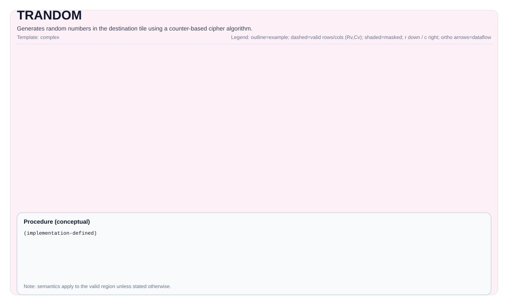

# TRANDOM

<!-- md-trans-meta sourceCommit=unknown translatedAt=2026-08-26T04:45:22.970Z pushedAt=2026-08-29T09:05:18.455Z -->

## Tile Operation Diagram



## Introduction

Generates random numbers in the destination tile using a counter-based cryptographic algorithm.

## Mathematical Semantics

This instruction implements a counter-based random number generator. For each element in the valid region, it generates a pseudo-random value based on the key and counter state, using a cipher-like transformation with a configurable number of rounds.

The algorithm uses:

- A 128-bit state (4 × 32-bit counters)
- A 64-bit key (2 × 32-bit words)
- ChaCha-like quarter-round operations using vector instructions

## Assembly Syntax

Synchronous form:

```text
trandom %dst, %key, %counter : !pto.tile<...>
```

### AS Level 1 (SSA)

```text
%dst = pto.trandom %key, %counter : (!pto.tile<...>, !pto.tile<...>) -> !pto.tile<...>
```

### AS Level 2 (DPS)

```text
pto.trandom ins(%key, %counter : !pto.tile_buf<...>, !pto.tile_buf<...>) outs(%dst : !pto.tile_buf<...>)
```

## C++ Built-in Functions

Declared in `include/pto/common/pto_instr.hpp`:
> The public include header is `<pto/pto-inst.hpp>`, and the internal declaration is located in `pto/common/pto_instr.hpp`.

```cpp
template <uint16_t Rounds = 10, typename DstTile, typename... WaitEvents>
PTO_INST RecordEvent TRANDOM(DstTile &dst, TRandomKey &key, TRandomCounter &counter, WaitEvents &... events);
```

## Constraints

- **Implementation check (Ascend 950PR/Ascend 950DT)**:
    - `DstTile::DType` must be one of the following types: `int32_t`, `uint32_t`.
    - The tile layout must be row-major (`DstTile::isRowMajor`).
    - `Rounds` must be 7 or 10 (defaults to 10).
    - `key` and `counter` cannot be empty.
- **Valid region**:
    - This operation uses `dst.GetValidRow()`/`dst.GetValidCol()` as the iteration domain.

## Examples

### Automatic Mode

```cpp
#include <pto/pto-inst.hpp>

using namespace pto;

void example_auto() {
  using TileT = Tile<TileType::Vec, uint32_t, 16, 16>;
  TileT dst;
  TRandomKey key = {0x01234, 0x56789};
  TRandomCounter counter = {0, 0, 0, 0};
  TRANDOM(dst, key, counter);
}
```

### Manual Mode

```cpp
#include <pto/pto-inst.hpp>

using namespace pto;

void example_manual() {
  using TileT = Tile<TileType::Vec, uint32_t, 16, 16>;
  TileT dst;
  TRandomKey key = {0x01234, 0x56789};
  TRandomCounter counter = {0, 0, 0, 0};
  TASSIGN(dst, 0x0);
  TRANDOM<10>(dst, key, counter);
}
```

## ASM Examples

### Automatic Mode

```text
# Automatic mode: compiler/runtime-managed layout and scheduling.
%dst = pto.trandom %key, %counter : (!pto.tile<...>, !pto.tile<...>) -> !pto.tile<...>
```

### Manual Mode

```text
# Manual mode: explicitly bind resources before issuing the instruction.
# Tile operands are optional:
# pto.tassign %arg0, @tile(0x3000)
%dst = pto.trandom %key, %counter : (!pto.tile<...>, !pto.tile<...>) -> !pto.tile<...>
```

### PTO Assembly Form

```text
trandom %dst, %key, %counter : !pto.tile<...>
# AS Level 2 (DPS)
pto.trandom ins(%key, %counter : !pto.tile_buf<...>, !pto.tile_buf<...>) outs(%dst : !pto.tile_buf<...>)
```
