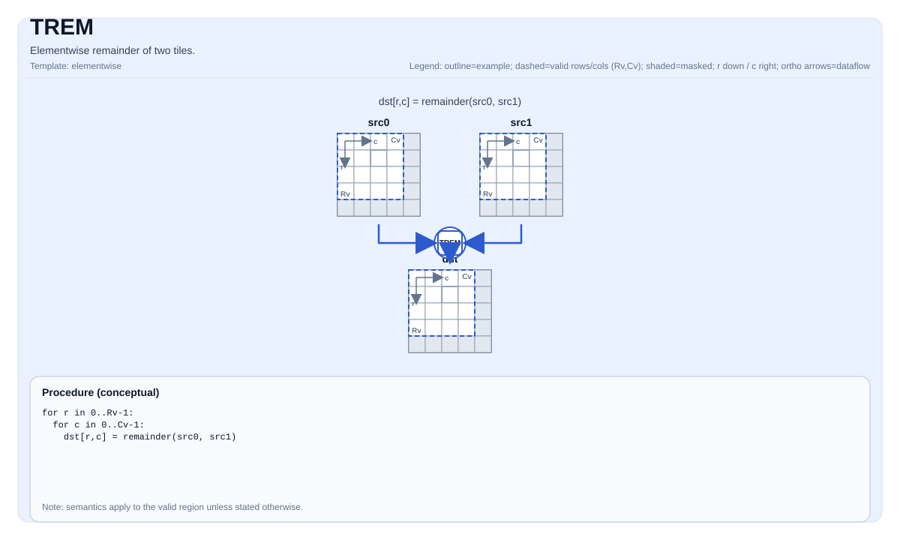

# TREM

<!-- md-trans-meta sourceCommit=unknown translatedAt=2026-08-26T04:48:30.445Z pushedAt=2026-08-29T09:05:18.456Z -->

## Instruction Diagram



## Introduction

Element-wise remainder operation on two tiles. The sign of the result is the same as that of the divisor.

## Mathematical Semantics

For each element `(i, j)` in the valid region:

$$\mathrm{dst}_{i,j} = \mathrm{remainder}(\mathrm{src0}_{i,j}, \mathrm{src1}_{i,j}) = \mathrm{src0}_{i,j} - \mathrm{floor}(\frac{\mathrm{src0}_{i,j}}{\mathrm{src1}_{i,j}}) \times \mathrm{src1}_{i,j}$$

The sign of the result is corrected to be the same as that of the divisor (`src1`).

**Note**: This differs from `TFMOD`, and the result sign of `TFMOD` is the same as that of the dividend (`src0`).

## Assembly Syntax

Synchronous form:

```text
%dst = trem %src0, %src1 : !pto.tile<...>
```

### AS Level 1 (SSA)

```text
%dst = pto.trem %src0, %src1 : (!pto.tile<...>, !pto.tile<...>) -> !pto.tile<...>
```

### AS Level 2 (DPS)

```text
pto.trem ins(%src0, %src1 : !pto.tile_buf<...>, !pto.tile_buf<...>) outs(%dst : !pto.tile_buf<...>)
```

## C++ Built-in APIs

Declared in `include/pto/common/pto_instr.hpp`:
> The public include header is `<pto/pto-inst.hpp>`, and the internal declaration is located in `pto/common/pto_instr.hpp`.

```cpp
template <auto PrecisionType = RemAlgorithm::DEFAULT, typename TileDataDst, typename TileDataSrc0,
          typename TileDataSrc1, typename TileDataTmp, typename... WaitEvents>
PTO_INST RecordEvent TREM(TileDataDst &dst, TileDataSrc0 &src0, TileDataSrc1 &src1, TileDataTmp &tmp, WaitEvents &... events);
```

## Constraints

- **Implementation check (Atlas A2/A3 training products/Atlas A2/A3 inference products)**:
    - `TileData::DType` must be one of the following: `float`, `float32_t`, `int32_t`.
    - The tile layout must be row-major (`TileData::isRowMajor`).
    - The tile position must be a vector (`TileData::Loc == TileType::Vec`).
    - Runtime: the `src0`, `src1`, and `dst` tiles should have the same `validRow/validCol`.
    - The `tmp` tile must have at least 2 rows and `validCols` columns (row 0 for intermediate results, row 1 for the comparison mask).
- **Implementation check (Ascend 950PR/Ascend 950DT)**:
    - `TileData::DType` must be one of the following: `half`, `float`, `int16_t`, `uint16_t`, `int32_t`, `uint32_t`.
    - The tile layout must be row-major (`TileData::isRowMajor`).
    - The tile position must be a vector (`TileData::Loc == TileType::Vec`).
    - Runtime: the `src0`, `src1`, and `dst` tiles should have the same `validRow/validCol`.
    - Note: The `tmp` parameter is accepted but not used on Ascend 950PR/Ascend 950DT.
- **Valid region**:
    - This operation uses `dst.GetValidRow()`/`dst.GetValidCol()` as the iteration domain.
- **Division by zero**:
    - The behavior is target-defined; the CPU emulation asserts in debug builds.
- **High-precision arithmetic**:
    - It is valid only for the `float` type on Ascend 950PR/Ascend 950DT; the `PrecisionType` option is ignored on Atlas A2/A3 training products/Atlas A2/A3 inference products.

## Examples

```cpp
#include <pto/pto-inst.hpp>

using namespace pto;

void example() {
  using TileT = Tile<TileType::Vec, float, 16, 16>;
  using TmpT = Tile<TileType::Vec, float, 2, 16>;
  TileT dst, src0, src1;
  TmpT tmp;
  TREM(dst, src0, src1, tmp);
}
```

## ASM Examples

### Automatic Mode

```text
# Automatic mode: the compiler/runtime is responsible for resource placement and scheduling.
%dst = pto.trem %src0, %src1 : (!pto.tile<...>, !pto.tile<...>) -> !pto.tile<...>
```

### Manual Mode

```text
# Manual mode: explicitly bind resources first, then issue the instruction.
# Optional (when the instruction contains tile operands):
# pto.tassign %arg0, @tile(0x1000)
# pto.tassign %arg1, @tile(0x2000)
%dst = pto.trem %src0, %src1 : (!pto.tile<...>, !pto.tile<...>) -> !pto.tile<...>
```

### PTO Assembly Form

```text
%dst = trem %src0, %src1 : !pto.tile<...>
# AS Level 2 (DPS)
pto.trem ins(%src0, %src1 : !pto.tile_buf<...>, !pto.tile_buf<...>) outs(%dst : !pto.tile_buf<...>)
```
