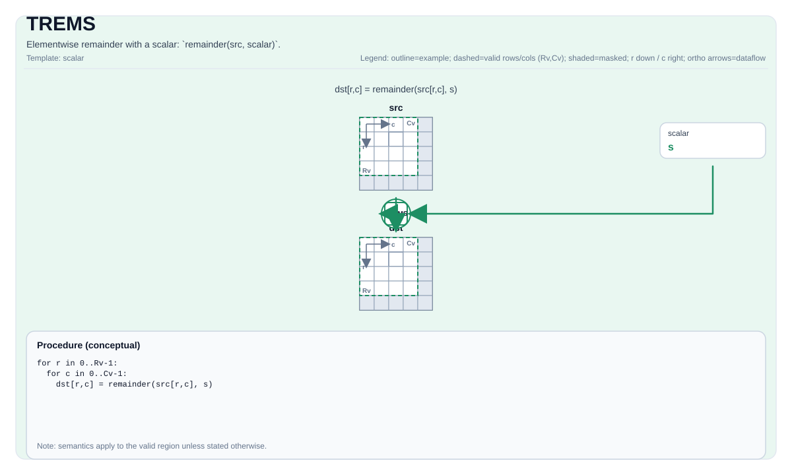

# TREMS

<!-- md-trans-meta sourceCommit=unknown translatedAt=2026-08-26T04:50:15.689Z pushedAt=2026-08-29T09:05:18.457Z -->

## Instruction Diagram



## Introduction

Element-wise remainder with a scalar: `remainder(src, scalar)`.

## Mathematical Semantics

For each element `(i, j)` in the valid region:

$$\mathrm{dst}_{i,j} = \mathrm{src}_{i,j} \bmod \mathrm{scalar}$$

## Assembly Syntax

Synchronous form:

```text
%dst = trems %src, %scalar : !pto.tile<...>, f32
```

### AS Level 1 (SSA)

```text
%dst = pto.trems %src, %scalar : (!pto.tile<...>, dtype) -> !pto.tile<...>
```

### AS Level 2 (DPS)

```text
pto.trems ins(%src, %scalar : !pto.tile_buf<...>, dtype) outs(%dst : !pto.tile_buf<...>)
```

## C++ Built-in APIs

Declared in `include/pto/common/pto_instr.hpp`:
> The public include header is `<pto/pto-inst.hpp>`, and the internal declaration is located in `pto/common/pto_instr.hpp`.

```cpp
template <auto PrecisionType = RemSAlgorithm::DEFAULT, typename TileDataDst, typename TileDataSrc, typename TileDataTmp,
          typename... WaitEvents>
PTO_INST RecordEvent TREMS(TileDataDst &dst, TileDataSrc &src, typename TileDataSrc::DType scalar, TileDataTmp &tmp,
                           WaitEvents &...events);
```

`PrecisionType` can specify the following values:

* `RemSAlgorithm::DEFAULT`: normal algorithm that is fast but less accurate.
* `RemSAlgorithm::HIGH_PRECISION`: high-precision algorithm that is slower and supports only the `float` type.

## Constraints

- **Implementation check (Atlas A2/A3 training products/Atlas A2/A3 inference products)**:
    - `dst` and `src` must use the same element type.
    - Supported element types: `float` and `int32_t`.
    - `dst` and `src` must be vector tiles.
    - `dst` and `src` must be row-major.
    - Runtime: `dst.GetValidRow() == src.GetValidRow() > 0` and `dst.GetValidCol() == src.GetValidCol() > 0`.
    - **tmp buffer requirements**:
      - `tmp.GetValidCol() >= dst.GetValidCol()` (at least the same number of columns as dst)
      - `tmp.GetValidRow() >= 1` (at least 1 row)
      - The data type must match `TileDataDst::DType`.
- **Implementation check (Ascend 950PR/Ascend 950DT)**:
    - `dst` and `src` must use the same element type.
    - Supported element types: `float`, `int32_t`, `uint32_t`, `half`, `int16_t`, and `uint16_t`.
    - `dst` and `src` must be vector tiles.
    - The static valid boundaries of both tiles must satisfy `ValidRow <= Rows` and `ValidCol <= Cols`.
    - Runtime: `dst.GetValidRow() == src.GetValidRow()` and `dst.GetValidCol() == src.GetValidCol()`.
    - Note: The tmp parameter is accepted but not validated or used on Ascend 950PR/Ascend 950DT.
- **Division by zero**:
    - The behavior is target-defined; the CPU simulator asserts in debug builds.
- **Valid region**:
    - This operation uses `dst.GetValidRow()`/`dst.GetValidCol()` as the iteration domain.
- **For `int32_t` inputs (Atlas A2/A3 training products/Atlas A2/A3 inference products only)**: The elements of `src` and `scalar` must be within the range `[-2^24, 2^24]` (that is, `[-16777216, 16777216]`) to ensure exact conversion to float32 during computation.
- **High-precision algorithm**:
    - Valid only on Ascend 950PR/Ascend 950DT; the `PrecisionType` option is ignored on Atlas A3 training products/Atlas A3 inference products.

## Examples

```cpp
#include <pto/pto-inst.hpp>

using namespace pto;

void example() {
  using TileT = Tile<TileType::Vec, float, 16, 16>;
  TileT x, out;
  Tile<TileType::Vec, float, 16, 16> tmp;
  TREMS(out, x, 3.0f, tmp);
}
```

## ASM Examples

### Automatic Mode

```text
# Automatic mode: the compiler/runtime is responsible for resource placement and scheduling.
%dst = pto.trems %src, %scalar : (!pto.tile<...>, dtype) -> !pto.tile<...>
```

### Manual Mode

```text
# Manual mode: bind resources explicitly first, then issue the instruction.
# Optional (when the instruction contains tile operands):
# pto.tassign %arg0, @tile(0x1000)
# pto.tassign %arg1, @tile(0x2000)
%dst = pto.trems %src, %scalar : (!pto.tile<...>, dtype) -> !pto.tile<...>
```

### PTO Assembly Form

```text
%dst = trems %src, %scalar : !pto.tile<...>, f32
# AS Level 2 (DPS)
pto.trems ins(%src, %scalar : !pto.tile_buf<...>, dtype) outs(%dst : !pto.tile_buf<...>)
```
