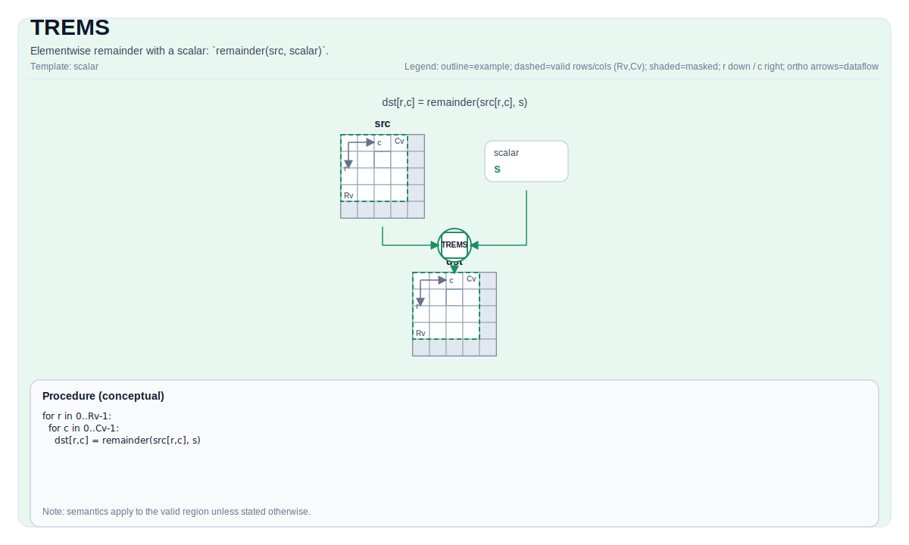

# TREMS

## 指令示意图



## 简介

与标量的逐元素余数：`remainder(src, scalar)`。

## 数学语义

对每个元素 `(i, j)` 在有效区域内：

$$\mathrm{dst}_{i,j} = \mathrm{src}_{i,j} \bmod \mathrm{scalar}$$

## 汇编语法

PTO-AS 形式：参见 [PTO-AS 规范](../assembly/PTO-AS_zh.md)。

同步形式：

```text
%dst = trems %src, %scalar : !pto.tile<...>, f32
```

### AS Level 1（SSA）

```text
%dst = pto.trems %src, %scalar : (!pto.tile<...>, dtype) -> !pto.tile<...>
```

### AS Level 2（DPS）

```text
pto.trems ins(%src, %scalar : !pto.tile_buf<...>, dtype) outs(%dst : !pto.tile_buf<...>)
```

## C++ 内建接口

声明于 `include/pto/common/pto_instr.hpp`：

```cpp
template <typename TileDataDst, typename TileDataSrc, typename... WaitEvents>
PTO_INST RecordEvent TREMS(TileDataDst &dst, TileDataSrc &src, typename TileDataSrc::DType scalar, WaitEvents &... events);
```

## 约束

- **实现检查 (A2A3)**:
    - `dst` 和 `src` 必须使用相同的元素类型。
    - 支持的元素类型为 `float`、`float32_t` 和 `int32_t`。
    - `dst` 和 `src` 必须是向量 Tile。
    - `dst` 和 `src` 必须是行主序。
    - 运行时：`dst.GetValidRow() == src.GetValidRow() > 0` 且 `dst.GetValidCol() == src.GetValidCol() > 0`。
- **实现检查 (A5)**:
    - `dst` 和 `src` 必须使用相同的元素类型。
    - 支持的元素类型为目标实现支持的 2 字节或 4 字节类型。
    - `dst` 和 `src` 必须是向量 Tile。
    - 两个 Tile 的静态有效边界都必须满足 `ValidRow <= Rows` 且 `ValidCol <= Cols`。
    - 运行时：`dst.GetValidRow() == src.GetValidRow()` 且 `dst.GetValidCol() == src.GetValidCol()`。
- **除零**:
    - 行为由目标定义；CPU 模拟器在调试构建中会断言。
- **有效区域**:
    - 该操作使用 `dst.GetValidRow()` / `dst.GetValidCol()` 作为迭代域。

## 示例

```cpp
#include <pto/pto-inst.hpp>

using namespace pto;

void example() {
  using TileT = Tile<TileType::Vec, float, 16, 16>;
  TileT x, out;
  TREMS(out, x, 3.0f);
}
```

## 汇编示例（ASM）

### 自动模式

```text
# 自动模式：由编译器/运行时负责资源放置与调度。
%dst = pto.trems %src, %scalar : (!pto.tile<...>, dtype) -> !pto.tile<...>
```

### 手动模式

```text
# 手动模式：先显式绑定资源，再发射指令。
# 可选（当该指令包含 tile 操作数时）：
# pto.tassign %arg0, @tile(0x1000)
# pto.tassign %arg1, @tile(0x2000)
%dst = pto.trems %src, %scalar : (!pto.tile<...>, dtype) -> !pto.tile<...>
```

### PTO 汇编形式

```text
%dst = trems %src, %scalar : !pto.tile<...>, f32
# AS Level 2 (DPS)
pto.trems ins(%src, %scalar : !pto.tile_buf<...>, dtype) outs(%dst : !pto.tile_buf<...>)
```

