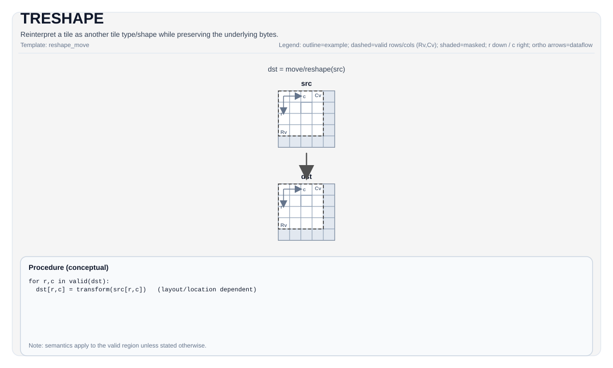

# TRESHAPE

<!-- md-trans-meta sourceCommit=unknown translatedAt=2026-08-26T04:50:24.793Z pushedAt=2026-08-29T09:05:18.458Z -->

## Instruction Diagram



## Introduction

Reinterprets a tile as another tile type/shape while preserving the underlying bytes.

## Mathematical Semantics

Unless otherwise specified, the semantics are defined on the valid region, and target-dependent behavior is marked as implementation-defined.

## Assembly Syntax

```text
%dst = treshape %src : !pto.tile<...>
```

### AS Level 1 (SSA)

```text
%dst = pto.treshape %src : !pto.tile<...> -> !pto.tile<...>
```

### AS Level 2 (DPS)

```text
pto.treshape ins(%src : !pto.tile_buf<...>) outs(%dst : !pto.tile_buf<...>)
```

## C++ Built-in APIs

Declared in `include/pto/common/pto_instr.hpp`:
> The public include header is `<pto/pto-inst.hpp>`, and the internal declaration is located in `pto/common/pto_instr.hpp`.

```cpp
template <typename TileDataOut, typename TileDataIn, typename... WaitEvents>
PTO_INST RecordEvent TRESHAPE(TileDataOut &dst, TileDataIn &src, WaitEvents &... events);
```

## Constraints

Enforced by `TRESHAPE_IMPL`:

- **Tile types must match**: `TileDataIn::Loc == TileDataOut::Loc`.
- **Total byte sizes must match**: `sizeof(InElem) * InNumel == sizeof(OutElem) * OutNumel`.
- **Boxed/non-boxed conversion is not allowed**:
    - Reshape between `SLayout::NoneBox` and boxed layouts is not allowed.

## Remarks

- **CPU simulation**: implemented as a byte-by-byte copy to `dst`.
- **Atlas A2/A3 training products/Atlas A2/A3 inference products**: implemented as an alias (`TASSIGN_IMPL(dst, src.data())`), so `dst` and `src` reference the same underlying storage.

## Examples

```cpp
#include <pto/pto-inst.hpp>

using namespace pto;

void example() {
  using Src = Tile<TileType::Vec, float, 16, 16>;
  using Dst = Tile<TileType::Vec, float, 8, 32>;
  static_assert(Src::Numel == Dst::Numel);

  Src src;
  Dst dst;
  TRESHAPE(dst, src);
}
```

## ASM Examples

### Automatic Mode

```text
# Automatic mode: the compiler/runtime is responsible for resource placement and scheduling.
%dst = pto.treshape %src : !pto.tile<...> -> !pto.tile<...>
```

### Manual Mode

```text
# Manual mode: explicitly bind resources first, then issue the instruction.
# Optional (when the instruction contains tile operands):
# pto.tassign %arg0, @tile(0x1000)
# pto.tassign %arg1, @tile(0x2000)
%dst = pto.treshape %src : !pto.tile<...> -> !pto.tile<...>
```

### PTO Assembly Form

```text
%dst = pto.treshape %src : !pto.tile<...> -> !pto.tile<...>
# AS Level 2 (DPS)
pto.treshape ins(%src : !pto.tile_buf<...>) outs(%dst : !pto.tile_buf<...>)
```
