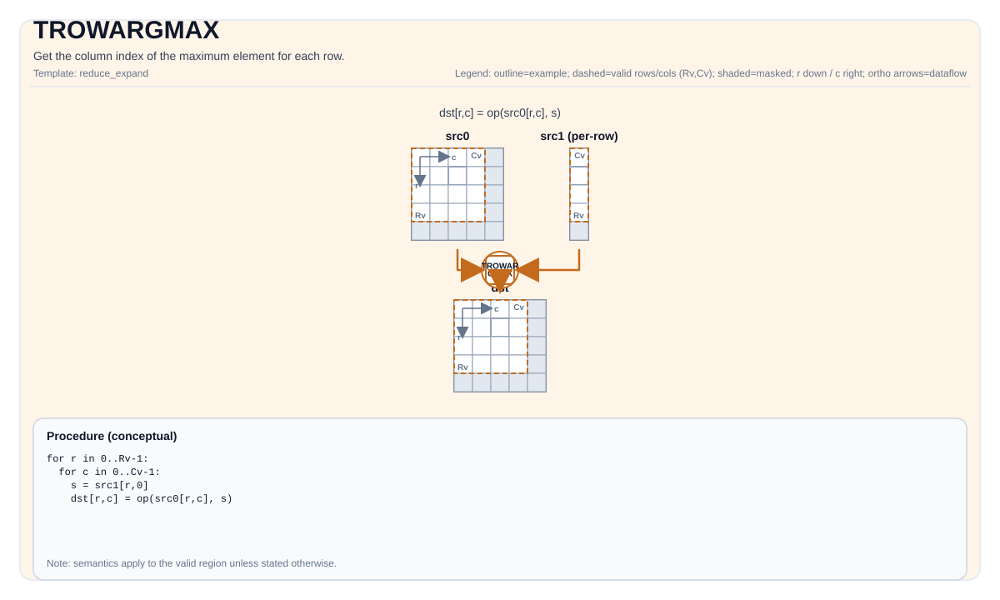

# TROWARGMAX

<!-- md-trans-meta sourceCommit=unknown translatedAt=2026-08-26T04:51:28.148Z pushedAt=2026-08-29T09:05:18.458Z -->

## Instruction Diagram



## Introduction

Obtains the column index corresponding to the maximum value in each row, or obtains both the maximum value in each row and its corresponding column index.

## Mathematical Semantics

Assume `R = src.GetValidRow()` and `C = src.GetValidCol()`. For `0 <= i < R`:

$$ \mathrm{dst}_{i,0} = \underset{0 \le j < C}{\operatorname{argmax}} \; \mathrm{src}_{i,j} $$

$$ \mathrm{dstval}_{i,0} = \max_{0 \le j < C} \mathrm{src}_{i,j} $$

## Assembly Syntax

Synchronous form:

```text
%dst = trowargmax %src : !pto.tile<...> -> !pto.tile<...>
```

Lowering may introduce internal scratch tiles; the C++ intrinsic requires an explicit `tmp` operand.

### IR Level 1 (SSA)

```text
%dst = pto.trowargmax %src, %tmp : (!pto.tile<...>, !pto.tile<...>) -> !pto.tile<...>
```

### IR Level 2 (DPS)

```text
pto.trowargmax ins(%src, %tmp : !pto.tile_buf<...>, !pto.tile_buf<...>) outs(%dst : !pto.tile_buf<...>)
```

## C++ Built-in APIs

Declared in `include/pto/common/pto_instr.hpp`:
> The public include header is `<pto/pto-inst.hpp>`, and the internal declaration is located in `pto/common/pto_instr.hpp`.

Outputs only the index:

```cpp
template <typename TileDataOut, typename TileDataIn, typename TileDataTmp, typename... WaitEvents>
PTO_INST RecordEvent TROWARGMAX(TileDataOut& dst, TileDataIn& src, TileDataTmp& tmp, WaitEvents&... events);
```

Outputs both the value and the index:

```cpp
template <typename TileDataOutVal, typename TileDataOutIdx, typename TileDataIn, typename TileDataTmp,
          typename... WaitEvents>
PTO_INST RecordEvent TROWARGMAX(TileDataOutVal &dstVal, TileDataOutIdx &dstIdx, TileDataIn &src, TileDataTmp &tmp,
                                WaitEvents &... events)
```

## Constraints

### General Constraints or Checks

- Supported source element types: `half`, `float`, `int32_t`, `int16_t` (A2A3). A5 accepts any 2/4-byte source (`half`, `bfloat16_t`, `int16_t`, `uint16_t`, `float`, `int32_t`, `uint32_t`).
- `src` must use the standard ND layout: row-major and non-fractal (`BLayout::RowMajor`, `SLayout::NoneBox`).
- When outputting only the index:
    - `dst` and `src` must be `TileType::Vec`.
    - Supported destination element types: `uint32_t`, `int32_t`.
    - Runtime checks follow the shared row reduction check path:
        - `src.GetValidRow() != 0`
        - `src.GetValidCol() != 0`
        - `src.GetValidRow() == dst.GetValidRow()`
    - `dst` is constrained through the shared row reduction index check path and can use any of the following non-fractal layouts:
        - A single-column DN layout (`BLayout::ColMajor`, `Cols == 1`), or
        - An ND layout with a valid column count of 1.
- When outputting both the value and index:
    - `dstVal`, `dstIdx`, and `src` must be `TileType::Vec`.
    - The element type of `dstVal` must be the same as the element type of `src`.
    - Supported destination element types:
        - When the source element type is `float`, `uint32_t` and `int32_t` are supported.
        - When the source element type is `half`, `uint16_t` and `int16_t` are supported.
    - The runtime check follows the shared row reduction check path:
        - `src.GetValidRow() != 0`
        - `src.GetValidCol() != 0`
        - `src.GetValidRow() == dstIdx.GetValidRow()`
        - `src.GetValidRow() == dstVal.GetValidRow()`
    - `dstVal` and `dstIdx` are constrained through the shared row reduction index check path, and can use any of the following non-fractal layouts:
        - A single column DN layout (`BLayout::ColMajor`, `Cols == 1`), or
        - An ND layout with a valid column count of 1.

### `tmp` Tile Description

- Only Atlas A2/A3 training products/Atlas A2/A3 inference products use the `tmp` tile. Ascend 950PR/Ascend 950DT receive `tmp` but do not actually use it.
- The implementation of Atlas A2/A3 training products/Atlas A2/A3 inference products selects one of three code paths based on the relationship between `srcValidCol` and `elementPerRepeat` (abbreviated as `elemPerRpt`):

#### Case 1: `srcValidCol <= elemPerRpt`

- **Index-only mode**: `tmp` is **not used**. The hardware `vcmax` instruction writes directly to `dst`.
- **Value+index mode**: `tmp` is used as a small buffer (2 elements per row: one value + one index). `tmp` can use either of the following non-fractal layouts:
    - Single-column DN layout (`BLayout::ColMajor`, `Cols == 1`), with a valid row count of `srcValidRow * 2`.
    - ND layout with a valid row count of `srcValidRow` and a valid column count of 2.

#### Case 2: `elemPerRpt < srcValidCol <= elemPerRpt²` (Single-Stage Reduction)

- `tmp` **is used** for single-stage reduction.
- The number of rows of the `tmp` tile is the same as that of `src`.
- The stride required for each row of the `tmp` tile is calculated using the following formula:

```text
R1 = ceil(validCol / elemPerRpt)
stride = (ceil(R1 * 2 / elemPerBlock) + ceil(R1 / elemPerBlock)) * elemPerBlock
```

#### Case 3: `srcValidCol > elemPerRpt²` (Two-Stage Reduction)

- `tmp` **is used** for two-stage reduction, requiring more space than single-stage.
- The number of rows of the `tmp` tile is the same as that of `src`.
- The stride required for each row of the `tmp` tile is calculated using the following formula:

```text
R1 = ceil(validCol / elemPerRpt)
R2 = ceil(R1 / elemPerRpt)
stage1_size = ceil(R1 * 2 / elemPerBlock) * elemPerBlock
stage2_end  = ceil(R1 / elemPerBlock) * elemPerBlock + ceil(R2 * 2 / elemPerBlock) * elemPerBlock
stride = max(stage1_size, stage2_end) + 2
```

- `+ 2` is used to store the final value + index result at the end of each row's tmp region.

## Examples

### Automatic

```cpp
#include <pto/pto-inst.hpp>

using namespace pto;

void example_auto() {
  using SrcT = Tile<TileType::Vec, float, 16, 16>;
  using DstT = Tile<TileType::Vec, uint32_t, 16, 1, BLayout::ColMajor>;
  using DstValT = Tile<TileType::Vec, float, 16, 1, BLayout::ColMajor>;
  using TmpT = Tile<TileType::Vec, float, 16, 16>;
  SrcT src;
  DstT dst;
  DstValT dstVal;
  TmpT tmp;
  TROWARGMAX(dst, src, tmp);
  TROWARGMAX(dstVal, dst, src, tmp);
}
```

### Manual

```cpp
#include <pto/pto-inst.hpp>

using namespace pto;

void example_manual() {
  using SrcT = Tile<TileType::Vec, float, 16, 16>;
  using DstT = Tile<TileType::Vec, uint32_t, 16, 1, BLayout::ColMajor>;
  using DstValT = Tile<TileType::Vec, float, 16, 1, BLayout::ColMajor>;
  using TmpT = Tile<TileType::Vec, float, 16, 16>;
  SrcT src;
  DstT dstIdx;
  DstValT dstVal;
  TmpT tmp;
  TASSIGN(src, 0x1000);
  TASSIGN(dstIdx, 0x2000);
  TASSIGN(dstVal, 0x3000);
  TASSIGN(tmp, 0x4000);
  TROWARGMAX(dstIdx, src, tmp);
  TROWARGMAX(dstVal, dstIdx, src, tmp);
}
```

## ASM Examples

### Automatic Mode

```text
# Automatic mode: the compiler/runtime handles resource placement and scheduling.
%dst = pto.trowargmax %src, %tmp : (!pto.tile<...>, !pto.tile<...>) -> !pto.tile<...>
```

### Manual Mode

```text
# Manual mode: explicitly bind resources first, then issue the instruction.
# Optional (when the instruction contains tile operands):
# pto.tassign %arg0, @tile(0x1000)
# pto.tassign %arg1, @tile(0x2000)
%dst = pto.trowargmax %src, %tmp : (!pto.tile<...>, !pto.tile<...>) -> !pto.tile<...>
```

### PTO Assembly Form

```text
%dst = trowargmax %src : !pto.tile<...> -> !pto.tile<...>
# IR Level 2 (DPS)
pto.trowargmax ins(%src, %tmp : !pto.tile_buf<...>, !pto.tile_buf<...>) outs(%dst : !pto.tile_buf<...>)
```
