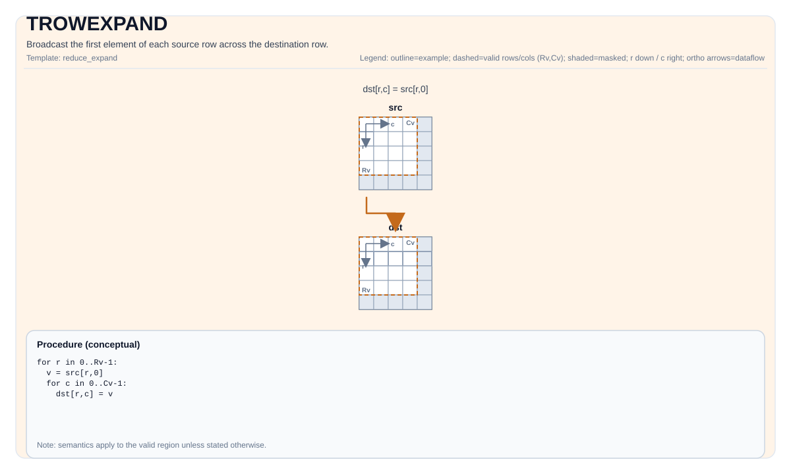

# TROWEXPAND

<!-- md-trans-meta sourceCommit=unknown translatedAt=2026-08-26T04:53:06.086Z pushedAt=2026-08-29T09:05:18.459Z -->

## Instruction Diagram



## Introduction

Broadcasts the first element of each source row to the destination row.

## Mathematical Semantics

Assume `R = dst.GetValidRow()` and `C = dst.GetValidCol()`. For `0 <= i < R` and `0 <= j < C`:

$$ \mathrm{dst}_{i,j} = \mathrm{src}_{i,0} $$

## Assembly Syntax

Synchronous form:

```text
%dst = trowexpand %src : !pto.tile<...> -> !pto.tile<...>
```

### AS Level 1 (SSA)

```text
%dst = pto.trowexpand %src : !pto.tile<...> -> !pto.tile<...>
```

### AS Level 2 (DPS)

```text
pto.trowexpand ins(%src : !pto.tile_buf<...>) outs(%dst : !pto.tile_buf<...>)
```

## C++ Built-in APIs

Declared in `include/pto/common/pto_instr.hpp`:
> The public include header is `<pto/pto-inst.hpp>`, and the internal declaration is located in `pto/common/pto_instr.hpp`.

```cpp
template <typename TileDataDst, typename TileDataSrc, typename... WaitEvents>
PTO_INST RecordEvent TROWEXPAND(TileDataDst &dst, TileDataSrc &src, WaitEvents &... events);
```

## Constraints

Implementation check (NPU):

- Tile type: `dst` and `src` must be `TileType::Vec`.
- Tile layout: `src` and `dst` are both ND fractals (`isRowMajor` and `SLayout::NoneBox`).
- Data type: For Atlas A2/A3 training products/Atlas A2/A3 inference products/Ascend 950PR/Ascend 950DT, the element type must be one of the following: `int8_t`, `uint8_t`, `int16_t`, `uint16_t`, `int32_t`, `uint32_t`, `half`, `bfloat16_t`, `float`.
- Runtime valid region check:
    - Atlas A2/A3 training products/Atlas A2/A3 inference products: if any of `dstValidRow`, `dstValidCol`, `srcValidRow`, or `srcValidCol` is zero, return early.
    - Ascend 950PR/Ascend 950DT: assert `srcValidRow == dstValidRow`, and assert `srcValidRow != 0 && srcValidCol != 0`.

## Examples

### Automatic

```cpp
#include <pto/pto-inst.hpp>

using namespace pto;

void example_auto() {
  using SrcT = Tile<TileType::Vec, float, 16, 16>;
  using DstT = Tile<TileType::Vec, float, 16, 16>;
  SrcT src;
  DstT dst;
  TROWEXPAND(dst, src);
}
```

### Manual

```cpp
#include <pto/pto-inst.hpp>

using namespace pto;

void example_manual() {
  using SrcT = Tile<TileType::Vec, float, 16, 16>;
  using DstT = Tile<TileType::Vec, float, 16, 16>;
  SrcT src;
  DstT dst;
  TASSIGN(src, 0x1000);
  TASSIGN(dst, 0x2000);
  TROWEXPAND(dst, src);
}
```

## ASM Examples

### Automatic Mode

```text
# Automatic mode: the compiler/runtime handles resource placement and scheduling.
%dst = pto.trowexpand %src : !pto.tile<...> -> !pto.tile<...>
```

### Manual Mode

```text
# Manual mode: explicitly bind resources first, then issue the instruction.
# Optional (when the instruction contains tile operands):
# pto.tassign %arg0, @tile(0x1000)
# pto.tassign %arg1, @tile(0x2000)
%dst = pto.trowexpand %src : !pto.tile<...> -> !pto.tile<...>
```

### PTO Assembly Form

```text
%dst = trowexpand %src : !pto.tile<...> -> !pto.tile<...>
# AS Level 2 (DPS)
pto.trowexpand ins(%src : !pto.tile_buf<...>) outs(%dst : !pto.tile_buf<...>)
```
