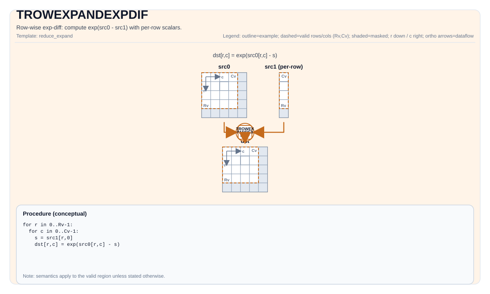

# TROWEXPANDEXPDIF

<!-- md-trans-meta sourceCommit=unknown translatedAt=2026-08-26T04:56:50.361Z pushedAt=2026-08-29T09:05:18.461Z -->

## Instruction Diagram



## Introduction

Row exponential difference operation: computes exp(src0 - src1), where src1 is a per-row scalar.

## Mathematical Semantics

Assume `R = dst.GetValidRow()` and `C = dst.GetValidCol()`. Assume that `s_i` is the per-row scalar obtained from `src1` (one value per row).

For `0 <= i < R` and `0 <= j < C`:

$$
\mathrm{dst}_{i,j} = \exp(\mathrm{src0}_{i,j} - s_i)
$$

## Assembly Syntax

Synchronous form:

```text
%dst = trowexpandexpdif %src0, %src1 : !pto.tile<...>, !pto.tile<...> -> !pto.tile<...>
```

### AS Level 1 (SSA)

```text
%dst = pto.trowexpandexpdif %src0, %src1 : !pto.tile<...>, !pto.tile<...> -> !pto.tile<...>
```

### AS Level 2 (DPS)

```text
pto.trowexpandexpdif ins(%src0, %src1 : !pto.tile_buf<...>, !pto.tile_buf<...>) outs(%dst : !pto.tile_buf<...>)
```

## C++ Built-in APIs

Declared in `include/pto/common/pto_instr.hpp`:
> The public include header is `<pto/pto-inst.hpp>`, and the internal declaration is located in `pto/common/pto_instr.hpp`.

```cpp
template <typename TileDataDst, typename TileDataSrc0, typename TileDataSrc1, typename... WaitEvents>
PTO_INST RecordEvent TROWEXPANDEXPDIF(TileDataDst &dst, TileDataSrc0 &src0, TileDataSrc1 &src1, WaitEvents &... events);

template <typename TileDataDst, typename TileDataSrc0, typename TileDataSrc1, typename TileDataTmp,
          typename... WaitEvents>
PTO_INST RecordEvent TROWEXPANDEXPDIF(TileDataDst &dst, TileDataSrc0 &src0, TileDataSrc1 &src1, TileDataTmp &tmp, WaitEvents &... events);
```

## Constraints

- `TileDataDst::DType == TileDataSrc0::DType == TileDataSrc1::DType`
- `TileDataDst::DType`, `TileDataSrc0::DType`, and `TileDataSrc1::DType` must be one of the following: `half`, `float`.
- Tile shape/layout constraint (compile time): `TileDataDst::isRowMajor`.
- Mode 1: `src1` is expected to provide **one scalar per row** (that is, its effective shape must cover `R` values).
- Mode 2: `src1` is expected to provide **32 bytes of data per row**.
- The exact layout/fractal constraints are target-specific; see the backend headers under `include/pto/npu/*/TRowExpand*.hpp`.

### Temporary Tile

The C++ API provides an overload that explicitly passes in `TileDataTmp &tmp`. This overload supports only **mode 1** (ColMajor expanded operand, per-row scalar). In the internal implementation, `TROWEXPANDEXPDIF` is implemented by `TROWEXPANDSUB` followed by `TEXP`, so the tmp tile is used as the broadcast buffer for the SUB step.

- **Atlas A2/A3 training products/Atlas A2/A3 inference products**: The tmp tile is used as the broadcast buffer for the `TROWEXPANDSUB` step. The per-row scalar value of the ColMajor expanded operand is broadcast to the tmp buffer through the `vbrcb` instruction, creating a 32-byte block for each row, which is then used as the expanded operand in the subtraction operation. The repeat stride of the `vbrcb` instruction is 8 blocks (256 bytes), and each repeat processes 8 rows. The minimum tmp size is calculated as follows:
    - **Common parameters**:
        - `R = dst.GetValidRow()`, `T = TileDataDst::DType`.
    - When `R < 256`:
        $$ \text{tmpSize} = \left\lceil\frac{R}{8}\right\rceil \times 256 \text{ bytes} $$
    - When `R >= 256`:
        - The operation uses a loop approach, with at most 30 repeats (240 rows) per loop. The tmp buffer is reused across loops, and each loop requires:
        $$ \text{tmpSize} = 30 \times 256 = 7680 \text{ bytes} $$
    - For any mode 1 call, a compact shape-independent upper bound is **8 KB** (8192 bytes).
    - The 3-parameter overload without `tmp` supports mode 1 and mode 2. For mode 1, it uses the internal 8 KB buffer (`TMP_UB_OFFSET`). For mode 2, no broadcast buffer is required.
- **Ascend 950PR/Ascend 950DT**: The `tmp` tile is accepted but not used (`[[maybe_unused]]`). The Ascend 950PR/Ascend 950DT hardware natively supports row broadcast through the broadcast mode of the `vlds` instruction, so no temporary buffer is required.

## Examples

See the related examples in `docs/isa/` and `docs/coding/tutorials/`.

## ASM Examples

### Automatic Mode

```text
# Automatic mode: the compiler/runtime is responsible for resource placement and scheduling.
%dst = pto.trowexpandexpdif %src0, %src1 : !pto.tile<...>, !pto.tile<...> -> !pto.tile<...>
```

### Manual Mode

```text
# Manual mode: explicitly bind resources first, then issue the instruction.
# Optional (when the instruction contains tile operands):
# pto.tassign %arg0, @tile(0x1000)
# pto.tassign %arg1, @tile(0x2000)
%dst = pto.trowexpandexpdif %src0, %src1 : !pto.tile<...>, !pto.tile<...> -> !pto.tile<...>
```

### PTO Assembly Form

```text
%dst = trowexpandexpdif %src0, %src1 : !pto.tile<...>, !pto.tile<...> -> !pto.tile<...>
# AS Level 2 (DPS)
pto.trowexpandexpdif ins(%src0, %src1 : !pto.tile_buf<...>, !pto.tile_buf<...>) outs(%dst : !pto.tile_buf<...>)
```
