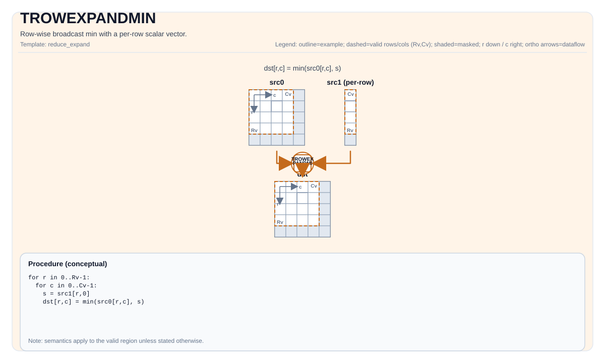
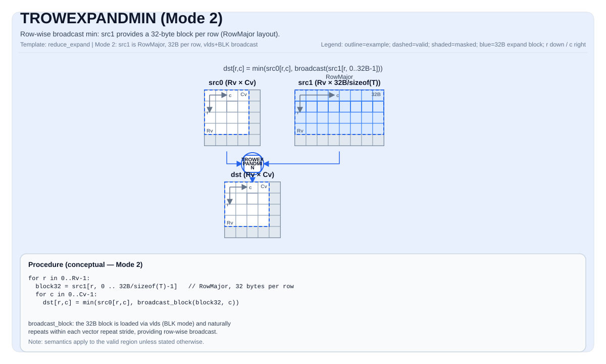

# TROWEXPANDMIN

<!-- md-trans-meta sourceCommit=unknown translatedAt=2026-08-26T04:58:07.433Z pushedAt=2026-08-29T09:05:18.462Z -->

## Instruction Diagram

### Mode 1 — Scalar per Row (ColMajor src1)



### Mode 2 — 32-Byte Block per Row (RowMajor src1)



## Introduction

Row broadcast minimum value: takes the minimum value of each row of the full-size operand (`src0` or `src1`) with the scalar per row of the expanded operand.

The instruction supports two modes, determined by the layout of the expanded operand (`src1` when `src0` matches the `dst` shape, and `src0` when `src1` matches the `dst` shape):

- **Mode 1**: The expanded operand is in **ColMajor** layout with a single column (one scalar per row). Each scalar is broadcast to the entire row.
- **Mode 2**: The expanded operand is in **RowMajor** layout with `32 / sizeof(T)` columns per row (one 32-byte block per row). Each 32-byte block naturally repeats within the vector repeat stride, providing row-level broadcast.

## Mathematical Semantics

Assume `R = dst.GetValidRow()` and `C = dst.GetValidCol()`.

### Mode 1

Assume that `s_i` is the scalar per row obtained from the expanded operand (one value per row, ColMajor layout).

For `0 <= i < R` and `0 <= j < C`:

$$
\mathrm{dst}_{i,j} = \min(\mathrm{full}_{i,j}, s_i)
$$

Where `full` refers to the full-size operand with shape matching `dst` (which can be `src0` or `src1`).

### Mode 2

Assume that `b_i` is the 32-byte block obtained from the expanded operand in row `i` (RowMajor layout, `32 / sizeof(T)` values per row). This block repeats naturally within each vector repeat stride.

For `0 <= i < R` and `0 <= j < C`:

$$
\mathrm{dst}_{i,j} = \min(\mathrm{full}_{i,j}, b_i[\,j \bmod (32 / \mathit{sizeof}(T))\,])
$$

## Assembly Syntax

Synchronous form:

```text
%dst = trowexpandmin %src0, %src1 : !pto.tile<...>, !pto.tile<...> -> !pto.tile<...>
```

### AS Level 1 (SSA)

```text
%dst = pto.trowexpandmin %src0, %src1 : !pto.tile<...>, !pto.tile<...> -> !pto.tile<...>
```

### AS Level 2 (DPS)

```text
pto.trowexpandmin ins(%src0, %src1 : !pto.tile_buf<...>, !pto.tile_buf<...>) outs(%dst : !pto.tile_buf<...>)
```

## C++ Built-in APIs

Declared in `include/pto/common/pto_instr.hpp`:
> The public include header is `<pto/pto-inst.hpp>`, and the internal declaration is located in `pto/common/pto_instr.hpp`.

```cpp
template <typename TileDataDst, typename TileDataSrc0, typename TileDataSrc1, typename... WaitEvents>
PTO_INST RecordEvent TROWEXPANDMIN(TileDataDst &dst, TileDataSrc0 &src0, TileDataSrc1 &src1, WaitEvents &... events);

template <typename TileDataDst, typename TileDataSrc0, typename TileDataSrc1, typename TileDataTmp,
          typename... WaitEvents>
PTO_INST RecordEvent TROWEXPANDMIN(TileDataDst &dst, TileDataSrc0 &src0, TileDataSrc1 &src1, TileDataTmp &tmp, WaitEvents &... events);
```

## Constraints

- `TileDataDst::DType == TileDataSrc0::DType == TileDataSrc1::DType`
- `TileDataDst::DType`, `TileDataSrc0::DType`, and `TileDataSrc1::DType` must be one of the following: `half`, `float`, `int16`, `int32` (applicable to Atlas A2/A3 training products/Atlas A2/A3 inference products and Ascend 950PR/Ascend 950DT), `uint16`, `uint32`, `bfloat16_t`, `int8`, `uint8` (applicable to Ascend 950PR/Ascend 950DT).
- `TileDataDst` must be **RowMajor** (`TileDataDst::isRowMajor == true`).
- Exactly one of `src0` or `src1` must have the same valid shape as `dst` (that is, `validRow == dst.validRow` and `validCol == dst.validCol`); this operand is the full-size operand. The other operand is the **expanded operand** (row broadcast source).
- The full-size operand must be **RowMajor** (`isRowMajor == true`).

### Mode 1 — Expanded Operand Is ColMajor (Scalar per Row)

When the expanded operand is **ColMajor** (`isRowMajor == false`):

- Its valid column count must be **1** (one scalar per row): `srcX.GetValidCol() == 1`.
- Its valid row count must equal `dst.GetValidRow()`: `srcX.GetValidRow() == dst.GetValidRow()`.

### Mode 2 — Expanded Operand Is RowMajor (32-Byte Block per Row)

When the expanded operand is **RowMajor** (`isRowMajor == true`):

- Its valid column count must be **32 / sizeof(TileDataDst::DType)** (one 32-byte block per row): `srcX.GetValidCol() == 32 / sizeof(TileDataDst::DType)`.
  - For `half`/`int16`/`uint16`: `validCol == 16`.
  - For `float`/`int32`/`uint32`: `validCol == 8`.
- Its valid row count must equal `dst.GetValidRow()`: `srcX.GetValidRow() == dst.GetValidRow()`.

### Other Target-Specific Constraints

The specific layout, fractal, and alignment constraints may vary by backend target. See the backend header files under `include/pto/npu/*/TRowExpand*.hpp`.

### Temporary Tile

The C++ API provides an overload that explicitly passes in `TileDataTmp &tmp`. This overload supports only **mode 1** (ColMajor expanded operand, scalar per row).

- **Atlas A2/A3 training products/Atlas A2/A3 inference products**: The tmp tile is used as a broadcast buffer. The scalar value per row of the ColMajor expanded operand is broadcast to the tmp buffer through the `vbrcb` instruction, creating a 32-byte block for each row, which is then used as the expanded operand in the binary operation. The repeat stride of the `vbrcb` instruction is 8 blocks (256 bytes), and each repeat processes 8 rows. The minimum tmp size is calculated as follows:
    - **Common parameters**:
        - `R = dst.GetValidRow()`, `T = TileDataDst::DType`.
    - When `R < 256`:
        $$ \text{tmpSize} = \left\lceil\frac{R}{8}\right\rceil \times 256 \text{ bytes} $$
    - When `R >= 256`:
        - The operation uses a loop, with at most 30 repeats (240 rows) per iteration. The tmp buffer is reused across iterations, and each iteration requires:
        $$ \text{tmpSize} = 30 \times 256 = 7680 \text{ bytes} $$
    - For any mode 1 call, a compact shape-independent upper bound is **8 KB** (8192 bytes).
    - The 3-parameter overload without `tmp` supports mode 1 and mode 2. For mode 1, it uses the internal 8 KB buffer (`TMP_UB_OFFSET`). For mode 2, no broadcast buffer is required.
- **Ascend 950PR/Ascend 950DT**: The `tmp` tile is accepted but not used (`[[maybe_unused]]`). The Ascend 950PR/Ascend 950DT hardware natively supports row broadcast through the broadcast mode of the `vlds` instruction, so no temporary buffer is required.

## Examples

See the related examples in `docs/isa/` and `docs/coding/tutorials/`.

## ASM Examples

### Automatic Mode

```text
# Automatic mode: the compiler/runtime is responsible for resource placement and scheduling.
%dst = pto.trowexpandmin %src0, %src1 : !pto.tile<...>, !pto.tile<...> -> !pto.tile<...>
```

### Manual Mode

```text
# Manual mode: explicitly bind resources first, then issue the instruction.
# Optional (when the instruction contains tile operands):
# pto.tassign %arg0, @tile(0x1000)
# pto.tassign %arg1, @tile(0x2000)
%dst = pto.trowexpandmin %src0, %src1 : !pto.tile<...>, !pto.tile<...> -> !pto.tile<...>
```

### PTO Assembly Form

```text
%dst = trowexpandmin %src0, %src1 : !pto.tile<...>, !pto.tile<...> -> !pto.tile<...>
# AS Level 2 (DPS)
pto.trowexpandmin ins(%src0, %src1 : !pto.tile_buf<...>, !pto.tile_buf<...>) outs(%dst : !pto.tile_buf<...>)
```
