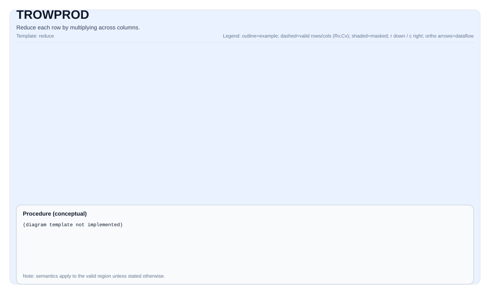

# TROWPROD

<!-- md-trans-meta sourceCommit=unknown translatedAt=2026-08-26T05:04:56.395Z pushedAt=2026-08-29T09:05:18.465Z -->

## Instruction Diagram



## Introduction

Performs product reduction on each row of elements.

## Mathematical Semantics

Assume `R = src.GetValidRow()` and `C = src.GetValidCol()`. For `0 <= i < R`:

$$ \mathrm{dst}_{i,0} = \prod_{j=0}^{C-1} \mathrm{src}_{i,j} $$

## Assembly Syntax

Synchronous form:

```text
%dst = trowprod %src : !pto.tile<...> -> !pto.tile<...>
```

Degradation may introduce an internal temporary tile; the C++ built-in function requires an explicit `tmp` operand.

### AS Level 1 (SSA)

```text
%dst = pto.trowprod %src, %tmp : (!pto.tile<...>, !pto.tile<...>) -> !pto.tile<...>
```

### AS Level 2 (DPS)

```text
pto.trowprod ins(%src, %tmp : !pto.tile_buf<...>, !pto.tile_buf<...>) outs(%dst : !pto.tile_buf<...>)
```

## C++ Built-in APIs

Declared in `include/pto/common/pto_instr.hpp`:
> The public include header is `<pto/pto-inst.hpp>`, and the internal declaration is located in `pto/common/pto_instr.hpp`.

```cpp
template <typename TileDataOut, typename TileDataIn, typename TileDataTmp, typename... WaitEvents>
PTO_INST RecordEvent TROWPROD(TileDataOut &dst, TileDataIn &src, TileDataTmp &tmp, WaitEvents &... events);
```

## Constraints

### General Constraints or Checks

- Both `dst` and `src` must be `TileType::Vec`.
- `src` must use the standard ND layout: row-major and non-fractal (`BLayout::RowMajor`, `SLayout::NoneBox`).
- `dst` must use one of the following two non-fractal layouts:
    - ND layout (`BLayout::RowMajor`, `SLayout::NoneBox`), or
    - DN layout with the number of columns strictly equal to 1 (`BLayout::ColMajor`, `SLayout::NoneBox`, `Cols == 1`).
- The element types of `dst` and `src` must be identical.
- Runtime valid region checks:
    - `src.GetValidRow() != 0`
    - `src.GetValidCol() != 0`
    - `src.GetValidRow() == dst.GetValidRow()`
- The built-in API signature requires explicitly passing the `tmp` operand.

### Implementation Check for Atlas A2/A3 Training Products/Atlas A2/A3 Inference Products

- Supported element types: `half`, `float`, `int32_t`, `int16_t`.

### Ascend 950PR/Ascend 950DT Implementation Check

- Supported element types: `half`, `float`, `int32_t`, `int16_t`.
- In the currently checked implementation path, the actual constraints apply to `src` and `dst`.
- In the current implementation path, there is no additional requirement that `tmp` must satisfy specific shape/layout constraints.

## Temporary Space

### Atlas A2/A3 Training Products/Atlas A2/A3 Inference Products

`tmp` **is used** as a row-wise accumulator buffer. For each row, the implementation initializes `tmp` to `1.0`, and then uses `vmul` to multiply each block of the `src` data into `tmp`. After all blocks are accumulated, the scalar-mode pipe reads the `tmp` elements and computes the final product.

- `tmp` must have the same element type as `src`/`dst`.
- `tmp` size: at least 1 row and `BLOCK_BYTE_SIZE / sizeof(T)` columns (that is, 1 block: 8 elements for `float`/`int32_t`, and 16 elements for `half`/`int16_t`).
- Safe default settings: set `tmp` to the same shape as `src`.

### Ascend 950PR/Ascend 950DT

`tmp` is accepted by the API but **not used** by the Ascend 950PR/Ascend 950DT implementation. The Ascend 950PR/Ascend 950DT backend uses vector-register-based reduction (`vmul` + `vintlv` for tree reduction) and does not require temporary tile storage. `tmp` is retained in the C++ built-in API signature only for API compatibility with Atlas A2/A3 training products/Atlas A2/A3 inference products.

## Examples

### Automatic Mode

```cpp
#include <pto/pto-inst.hpp>

using namespace pto;

void example_auto() {
  using SrcT = Tile<TileType::Vec, float, 16, 16>;
  using DstT = Tile<TileType::Vec, float, 16, 1, BLayout::ColMajor>;
  using TmpT = Tile<TileType::Vec, float, 16, 16>;
  SrcT src;
  DstT dst;
  TmpT tmp;
  TROWPROD(dst, src, tmp);
}
```

### Manual Mode

```cpp
#include <pto/pto-inst.hpp>

using namespace pto;

void example_manual() {
  using SrcT = Tile<TileType::Vec, float, 16, 16>;
  using DstT = Tile<TileType::Vec, float, 16, 1, BLayout::ColMajor>;
  using TmpT = Tile<TileType::Vec, float, 16, 16>;
  SrcT src;
  DstT dst;
  TmpT tmp;
  TASSIGN(src, 0x1000);
  TASSIGN(dst, 0x2000);
  TASSIGN(tmp, 0x3000);
  TROWPROD(dst, src, tmp);
}
```

## ASM Examples

### Automatic Mode

```text
# Automatic mode: placement and scheduling managed by the compiler/runtime.
%dst = pto.trowprod %src, %tmp : (!pto.tile<...>, !pto.tile<...>) -> !pto.tile<...>
```

### Manual Mode

```text
# Manual mode: explicitly bind resources before issuing the instruction.
# Tile operands are optional:
# pto.tassign %arg0, @tile(0x1000)
# pto.tassign %arg1, @tile(0x2000)
%dst = pto.trowprod %src, %tmp : (!pto.tile<...>, !pto.tile<...>) -> !pto.tile<...>
```

### PTO Assembly Form

```text
%dst = trowprod %src : !pto.tile<...> -> !pto.tile<...>
# AS Level 2 (DPS)
pto.trowprod ins(%src, %tmp : !pto.tile_buf<...>, !pto.tile_buf<...>) outs(%dst : !pto.tile_buf<...>)
```
