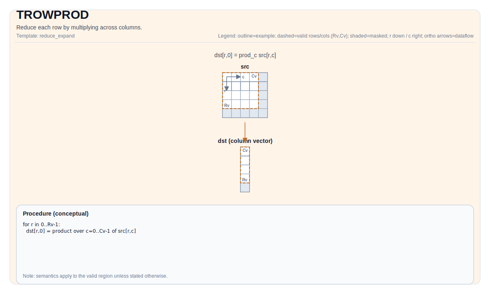

# TROWPROD

## 指令示意图



## 简介

对每一行沿列方向连乘归约。

## 数学语义

Let `R = src.GetValidRow()` and `C = src.GetValidCol()`. For `0 <= i < R`:

$$ \mathrm{dst}_{i,0} = \prod_{j=0}^{C-1} \mathrm{src}_{i,j} $$

## 汇编语法

PTO-AS 形式：参见 [PTO-AS Specification](../assembly/PTO-AS.md).

同步形式：

```text
%dst = trowprod %src : !pto.tile<...> -> !pto.tile<...>
```
Lowering may introduce internal scratch tiles; the C++ intrinsic requires an explicit `tmp` operand.

### AS Level 1 (SSA)

```text
%dst = pto.trowprod %src, %tmp : (!pto.tile<...>, !pto.tile<...>) -> !pto.tile<...>
```

### AS Level 2 (DPS)

```text
pto.trowprod ins(%src, %tmp : !pto.tile_buf<...>, !pto.tile_buf<...>) outs(%dst : !pto.tile_buf<...>)
```

### AS Level 1（SSA）

```text
%dst = pto.trowprod %src : !pto.tile<...> -> !pto.tile<...>
```

### AS Level 2（DPS）

```text
pto.trowprod ins(%src : !pto.tile_buf<...>) outs(%dst : !pto.tile_buf<...>)
```

## C++ 内建接口

声明于 `include/pto/common/pto_instr.hpp`:

```cpp
template <typename TileDataOut, typename TileDataIn, typename TileDataTmp, typename... WaitEvents>
PTO_INST RecordEvent TROWPROD(TileDataOut &dst, TileDataIn &src, TileDataTmp &tmp, WaitEvents &... events);
```

## 约束

实现检查 (NPU):

- A2A3:
    - Tile location: `dst` and `src` must be `TileType::Vec`.
    - Tile 布局 of `src`: ND fractal (`isRowMajor` and `SLayout::NoneBox`).
    - Tile 布局 of `dst`: DN layout Tile of 1D, e.g., `Tile<TileType::Vec, T, ROWS, 1, BLayout::ColMajor, ValidRows, 1>`
    - 数据类型: `half`, `float`.
    - 数据类型一致性: `dst.DType == src.DType`.
    - 运行期有效区域检查:
    - `srcValidCol != 0` and `srcValidRow != 0`.
    - `srcValidRow == dstValidRow` (the output valid row must match the input valid row).
    - `tmp` must have the same shape as `src`.

## 示例

### 自动（Auto）

```cpp
#include <pto/pto-inst.hpp>

using namespace pto;

void example_auto() {
  using SrcT = Tile<TileType::Vec, float, 16, 16>;
  using DstT = Tile<TileType::Vec, float, 16, 1, BLayout::ColMajor>;
  using TmpT = Tile<TileType::Vec, float, 16, 16>;
  SrcT src;
  DstT dst;
  TmpT tmp;
  TROWPROD(dst, src, tmp);
}
```

### 手动（Manual）

```cpp
#include <pto/pto-inst.hpp>

using namespace pto;

void example_manual() {
  using SrcT = Tile<TileType::Vec, float, 16, 16>;
  using DstT = Tile<TileType::Vec, float, 16, 1, BLayout::ColMajor>;
  using TmpT = Tile<TileType::Vec, float, 16, 16>;
  SrcT src;
  DstT dst;
  TmpT tmp;
  TASSIGN(src, 0x1000);
  TASSIGN(dst, 0x2000);
  TASSIGN(tmp, 0x3000);
  TROWPROD(dst, src, tmp);
}
```
