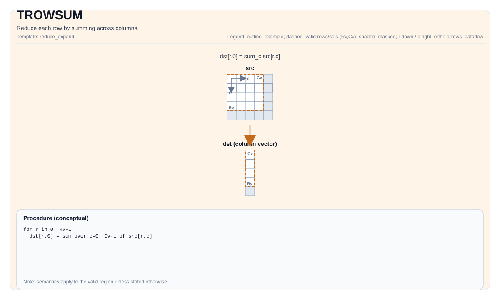

# TROWSUM

<!-- md-trans-meta sourceCommit=unknown translatedAt=2026-08-26T05:06:49.601Z pushedAt=2026-08-29T09:05:18.466Z -->

## Instruction Diagram



## Introduction

Reduces each row by summing its columns.

## Mathematical Semantics

Assume `R = src.GetValidRow()` and `C = src.GetValidCol()`. For `0 <= i < R`:

$$ \mathrm{dst}_{i,0} = \sum_{j=0}^{C-1} \mathrm{src}_{i,j} $$

## Assembly Syntax

Synchronous form:

```text
%dst = trowsum %src : !pto.tile<...> -> !pto.tile<...>
```

An internal temporary tile may be introduced during reduction; the C++ built-in API requires an explicit `tmp` operand.

### AS Level 1 (SSA)

```text
%dst = pto.trowsum %src, %tmp : (!pto.tile<...>, !pto.tile<...>) -> !pto.tile<...>
```

### AS Level 2 (DPS)

```text
pto.trowsum ins(%src, %tmp : !pto.tile_buf<...>, !pto.tile_buf<...>) outs(%dst : !pto.tile_buf<...>)
```

## C++ Built-in APIs

Declared in `include/pto/common/pto_instr.hpp`:
> The public include header is `<pto/pto-inst.hpp>`, and the internal declaration is located in `pto/common/pto_instr.hpp`.

```cpp
template <typename TileDataOut, typename TileDataIn, typename TileDataTmp, typename... WaitEvents>
PTO_INST RecordEvent TROWSUM(TileDataOut &dst, TileDataIn &src, TileDataTmp &tmp, WaitEvents &... events);
```

## Constraints

### General Constraints or Checks

- `dst` and `src` must both be `TileType::Vec`.
- `src` must use the standard ND layout: row-major and non-fractal (`BLayout::RowMajor`, `SLayout::NoneBox`).
- `dst` must be a non-fractal layout (`!isBoxedLayout`) and use one of the following two layouts:
    - ND layout (`BLayout::RowMajor`, `SLayout::NoneBox`), or
    - DN layout with the number of columns strictly equal to 1 (`BLayout::ColMajor`, `SLayout::NoneBox`, `Cols == 1`).
- `dst` and `src` must have the same element type.
- Runtime valid region checks:
    - `src.GetValidRow() != 0`
    - `src.GetValidCol() != 0`
    - `src.GetValidRow() == dst.GetValidRow()`
- The built-in API signature requires explicitly passing the `tmp` operand.

### Implementation Check for Atlas A2/A3 Training Products/Atlas A2/A3 Inference Products

- Supported element types (Atlas A2/A3 training products/Atlas A2/A3 inference products): `half`, `float`, `int32_t`, `int16_t`.
- Supported element types (Ascend 950PR/Ascend 950DT): `half`, `float`, `int32_t`, `int16_t`.
- The implementation accepts both ND output and DN output with `Cols == 1`, not only DN output.
- Runtime checks follow the shared row reduction check path:
    - `src.GetValidRow() != 0`
    - `src.GetValidCol() != 0`
    - `src.GetValidRow() == dst.GetValidRow()`

## Temporary Space

### Atlas A2/A3 Training Products/Atlas A2/A3 Inference Products

`tmp` **is used** as scratch storage for row reduction.

- For **integer** types (`int32_t`, `int16_t`): `tmp` is used as a row-wise accumulator buffer (1 block). For each row, `tmp` is initialized to 0, and then the blocks of `src` are accumulated through `vadd`. The final sum result is read from `tmp` in scalar mode.
  - `tmp` size: at least 1 row and `BLOCK_BYTE_SIZE / sizeof(T)` columns (8 for `int32_t`, 16 for `int16_t`).
- For **floating-point** types (`float`, `half`): `tmp` is used for binary tree reduction through `vcadd`/`vcgadd`.
  - Safe default settings: set `tmp` to the same shape as `src`.

### Ascend 950PR/Ascend 950DT

`tmp` is accepted by the API but is **not used** by the Ascend 950PR/Ascend 950DT implementation. The Ascend 950PR/Ascend 950DT backend uses vector-register-based reduction (the `vcadd` instruction) and does not require scratch tile storage. `tmp` is retained in the C++ built-in API signature only for API compatibility with the Atlas A2/A3 training products/Atlas A2/A3 inference products.

## Examples

### Automatic

```cpp
#include <pto/pto-inst.hpp>

using namespace pto;

void example_auto() {
  using SrcT = Tile<TileType::Vec, float, 16, 16>;
  using DstT = Tile<TileType::Vec, float, 16, 1, BLayout::ColMajor>;
  using TmpT = Tile<TileType::Vec, float, 16, 16>;
  SrcT src;
  DstT dst;
  TmpT tmp;
  TROWSUM(dst, src, tmp);
}
```

### Manual

```cpp
#include <pto/pto-inst.hpp>

using namespace pto;

void example_manual() {
  using SrcT = Tile<TileType::Vec, float, 16, 16>;
  using DstT = Tile<TileType::Vec, float, 16, 1, BLayout::ColMajor>;
  using TmpT = Tile<TileType::Vec, float, 16, 16>;
  SrcT src;
  DstT dst;
  TmpT tmp;
  TASSIGN(src, 0x1000);
  TASSIGN(dst, 0x2000);
  TASSIGN(tmp, 0x3000);
  TROWSUM(dst, src, tmp);
}
```

## ASM Examples

### Automatic Mode

```text
# Automatic mode: the compiler/runtime is responsible for resource placement and scheduling.
%dst = pto.trowsum %src, %tmp : (!pto.tile<...>, !pto.tile<...>) -> !pto.tile<...>
```

### Manual Mode

```text
# Manual mode: explicitly bind resources first, then issue the instruction.
# Optional (when the instruction contains tile operands):
# pto.tassign %arg0, @tile(0x1000)
# pto.tassign %arg1, @tile(0x2000)
%dst = pto.trowsum %src, %tmp : (!pto.tile<...>, !pto.tile<...>) -> !pto.tile<...>
```

### PTO Assembly Form

```text
%dst = trowsum %src : !pto.tile<...> -> !pto.tile<...>
# AS Level 2 (DPS)
pto.trowsum ins(%src, %tmp : !pto.tile_buf<...>, !pto.tile_buf<...>) outs(%dst : !pto.tile_buf<...>)
```
