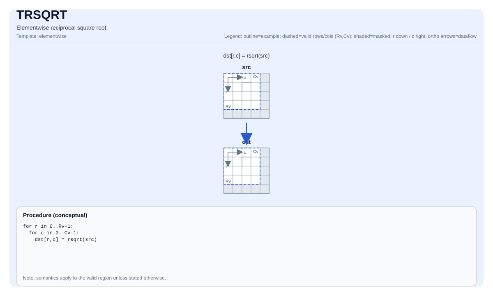

# TRSQRT

<!-- md-trans-meta sourceCommit=unknown translatedAt=2026-08-26T05:08:09.761Z pushedAt=2026-08-29T09:05:18.466Z -->

## Instruction Diagram



## Introduction

Computes the reciprocal square root of each element.

## Mathematical Semantics

For each element `(i, j)` in the valid region:

$$ \mathrm{dst}_{i,j} = \frac{1}{\sqrt{\mathrm{src}_{i,j}}} $$

## Assembly Syntax

Synchronous form:

```text
%dst = trsqrt %src : !pto.tile<...>
```

### AS Level 1 (SSA)

```text
%dst = pto.trsqrt %src : !pto.tile<...> -> !pto.tile<...>
```

### AS Level 2 (DPS)

```text
pto.trsqrt ins(%src : !pto.tile_buf<...>) outs(%dst : !pto.tile_buf<...>)
```

## C++ Built-in APIs

Declared in `include/pto/common/pto_instr.hpp`:
> The public include header is `<pto/pto-inst.hpp>`, and the internal declaration is located in `pto/common/pto_instr.hpp`.

```cpp
template <typename TileDataDst, typename TileDataSrc, typename... WaitEvents>
PTO_INST RecordEvent TRSQRT(TileDataDst &dst, TileDataSrc &src, WaitEvents &... events);

template <typename TileDataDst, typename TileDataSrc, typename TileDataTmp, typename... WaitEvents>
PTO_INST RecordEvent TRSQRT(TileDataDst &dst, TileDataSrc &src, TileDataTmp &tmp, WaitEvents &... events);
```

## Constraints

- **Implementation check (NPU)**:
    - `TileData::DType` must be one of the following: `float` or `half`.
    - The tile position must be a vector (`TileData::Loc == TileType::Vec`).
    - Static valid boundary: `TileData::ValidRow <= TileData::Rows` and `TileData::ValidCol <= TileData::Cols`.
    - Runtime: `src.GetValidRow() == dst.GetValidRow()` and `src.GetValidCol() == dst.GetValidCol()`.
    - The tile layout must be row-major (`TileData::isRowMajor`).
- **Valid region**:
    - This operation uses `dst.GetValidRow()`/`dst.GetValidCol()` as the iteration domain.
- **Domain/NaN**:
    - The behavior is target-defined (for example, for `src == 0` or negative input).

## Temporary Space

### Without `tmp` (2-Parameter Overload: `TRSQRT(dst, src)`)

No `tmp` is required. The default precision implementation directly uses `vsqrt` + `vdiv`.

### With `tmp` (3-Parameter Overload: `TRSQRT(dst, src, tmp)`)

`tmp` is accepted by the API but is **not used** by the current Ascend 950PR/Ascend 950DT implementation. The 3-parameter overload simply delegates to the 2-parameter implementation (`TRSQRT_IMPL<PrecisionType>(dst, src)`). `tmp` is retained in the C++ built-in API signature only for API compatibility and a potential future high-precision path.

## Examples

### Automatic

```cpp
#include <pto/pto-inst.hpp>

using namespace pto;

void example_auto() {
  using TileT = Tile<TileType::Vec, float, 16, 16>;
  TileT src, dst;
  TRSQRT(dst, src);
}
```

### Manual

```cpp
#include <pto/pto-inst.hpp>

using namespace pto;

void example_manual() {
  using TileT = Tile<TileType::Vec, float, 16, 16>;
  TileT src, dst;
  TASSIGN(src, 0x1000);
  TASSIGN(dst, 0x2000);
  TRSQRT(dst, src);
}
```

## ASM Examples

### Automatic Mode

```text
# Automatic mode: the compiler/runtime handles resource placement and scheduling.
%dst = pto.trsqrt %src : !pto.tile<...> -> !pto.tile<...>
```

### Manual Mode

```text
# Manual mode: explicitly bind resources first, then issue the instruction.
# Optional (when the instruction contains tile operands):
# pto.tassign %arg0, @tile(0x1000)
# pto.tassign %arg1, @tile(0x2000)
%dst = pto.trsqrt %src : !pto.tile<...> -> !pto.tile<...>
```

### PTO Assembly Form

```text
%dst = trsqrt %src : !pto.tile<...>
# AS Level 2 (DPS)
pto.trsqrt ins(%src : !pto.tile_buf<...>) outs(%dst : !pto.tile_buf<...>)
```
