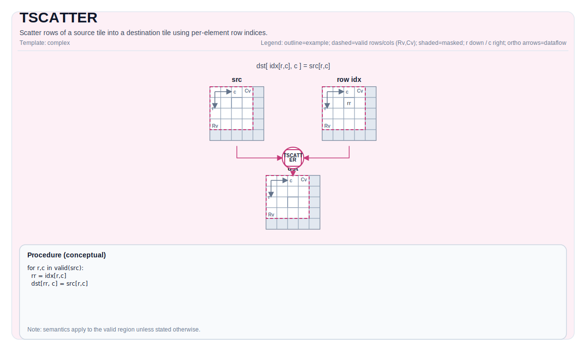

# TSCATTER

## 指令示意图



## 简介

使用逐元素行索引将源 Tile 的行散播到目标 Tile 中。

## 数学语义

对每个源元素 `(i, j)`，写入：

$$ \mathrm{dst}_{\mathrm{idx}_{i,j},\ j} = \mathrm{src}_{i,j} $$

若多个元素映射到同一目标位置，最终值由实现定义（当前实现中以最后写入者为准）。

## 汇编语法

PTO-AS 形式：参见 [PTO-AS 规范](../assembly/PTO-AS_zh.md)。

同步形式：

```text
%dst = tscatter %src, %idx : !pto.tile<...>, !pto.tile<...> -> !pto.tile<...>
```

### AS Level 1（SSA）

```text
%dst = pto.tscatter %src, %idx : (!pto.tile<...>, !pto.tile<...>) -> !pto.tile<...>
```

### AS Level 2（DPS）

```text
pto.tscatter ins(%src, %idx : !pto.tile_buf<...>, !pto.tile_buf<...>) outs(%dst : !pto.tile_buf<...>)
```

## C++ 内建接口

声明于 `include/pto/common/pto_instr.hpp`：

```cpp
template <typename TileDataD, typename TileDataS, typename TileDataI, typename... WaitEvents>
PTO_INST RecordEvent TSCATTER(TileDataD& dst, TileDataS& src, TileDataI& indexes, WaitEvents&... events);
```

## 约束

- **实现检查 (A2A3)**:
  - `TileDataD::Loc`、`TileDataS::Loc`、`TileDataI::Loc` 必须是 `TileType::Vec`。
  - `TileDataD::DType`、`TileDataS::DType` 必须是以下之一：`int32_t`、`int16_t`、`int8_t`、`half`、`float32_t`、`uint32_t`、`uint16_t`、`uint8_t`、`bfloat16_t`。
  - `TileDataI::DType` 必须是以下之一：`int16_t`、`int32_t`、`uint16_t` 或 `uint32_t`。
  - 不对 `indexes` 值执行边界检查。
  - 静态有效边界：`TileDataD::ValidRow <= TileDataD::Rows`、`TileDataD::ValidCol <= TileDataD::Cols`、`TileDataS::ValidRow <= TileDataS::Rows`、`TileDataS::ValidCol <= TileDataS::Cols`、`TileDataI::ValidRow <= TileDataI::Rows`、`TileDataI::ValidCol <= TileDataI::Cols`。
  - `TileDataD::DType` 与 `TileDataS::DType` 必须相同。
  - 当 `TileDataD::DType` 大小为 4 字节时，`TileDataI::DType` 大小必须为 4 字节。
  - 当 `TileDataD::DType` 大小为 2 字节时，`TileDataI::DType` 大小必须为 2 字节。
  - 当 `TileDataD::DType` 大小为 1 字节时，`TileDataI::DType` 大小必须为 2 字节。
- **实现检查 (A5)**:
  - `TileDataD::Loc`、`TileDataS::Loc`、`TileDataI::Loc` 必须是 `TileType::Vec`。
  - `TileDataD::DType`、`TileDataS::DType` 必须是以下之一：`int32_t`、`int16_t`、`int8_t`、`half`、`float32_t`、`uint32_t`、`uint16_t`、`uint8_t`、`bfloat16_t`。
  - `TileDataI::DType` 必须是以下之一：`int16_t`、`int32_t`、`uint16_t` 或 `uint32_t`。
  - 不对 `indexes` 值执行边界检查。
  - 静态有效边界：`TileDataD::ValidRow <= TileDataD::Rows`、`TileDataD::ValidCol <= TileDataD::Cols`、`TileDataS::ValidRow <= TileDataS::Rows`、`TileDataS::ValidCol <= TileDataS::Cols`、`TileDataI::ValidRow <= TileDataI::Rows`、`TileDataI::ValidCol <= TileDataI::Cols`。
  - `TileDataD::DType` 与 `TileDataS::DType` 必须相同。
  - 当 `TileDataD::DType` 大小为 4 字节时，`TileDataI::DType` 大小必须为 4 字节。
  - 当 `TileDataD::DType` 大小为 2 字节时，`TileDataI::DType` 大小必须为 2 字节。
  - 当 `TileDataD::DType` 大小为 1 字节时，`TileDataI::DType` 大小必须为 2 字节。

## 示例

### 自动（Auto）

```cpp
#include <pto/pto-inst.hpp>

using namespace pto;

void example_auto() {
  using TileT = Tile<TileType::Vec, float, 16, 16>;
  using IdxT = Tile<TileType::Vec, uint16_t, 16, 16>;
  TileT src, dst;
  IdxT idx;
  TSCATTER(dst, src, idx);
}
```

### 手动（Manual）

```cpp
#include <pto/pto-inst.hpp>

using namespace pto;

void example_manual() {
  using TileT = Tile<TileType::Vec, float, 16, 16>;
  using IdxT = Tile<TileType::Vec, uint16_t, 16, 16>;
  TileT src, dst;
  IdxT idx;
  TASSIGN(src, 0x1000);
  TASSIGN(dst, 0x2000);
  TASSIGN(idx, 0x3000);
  TSCATTER(dst, src, idx);
}
```

## 汇编示例（ASM）

### 自动模式

```text
# 自动模式：由编译器/运行时负责资源放置与调度。
%dst = pto.tscatter %src, %idx : (!pto.tile<...>, !pto.tile<...>) -> !pto.tile<...>
```

### 手动模式

```text
# 手动模式：先显式绑定资源，再发射指令。
# 可选（当该指令包含 tile 操作数时）：
# pto.tassign %arg0, @tile(0x1000)
# pto.tassign %arg1, @tile(0x2000)
%dst = pto.tscatter %src, %idx : (!pto.tile<...>, !pto.tile<...>) -> !pto.tile<...>
```

### PTO 汇编形式

```text
%dst = tscatter %src, %idx : !pto.tile<...>, !pto.tile<...> -> !pto.tile<...>
# IR Level 2 (DPS)
pto.tscatter ins(%src, %idx : !pto.tile_buf<...>, !pto.tile_buf<...>) outs(%dst : !pto.tile_buf<...>)
```

