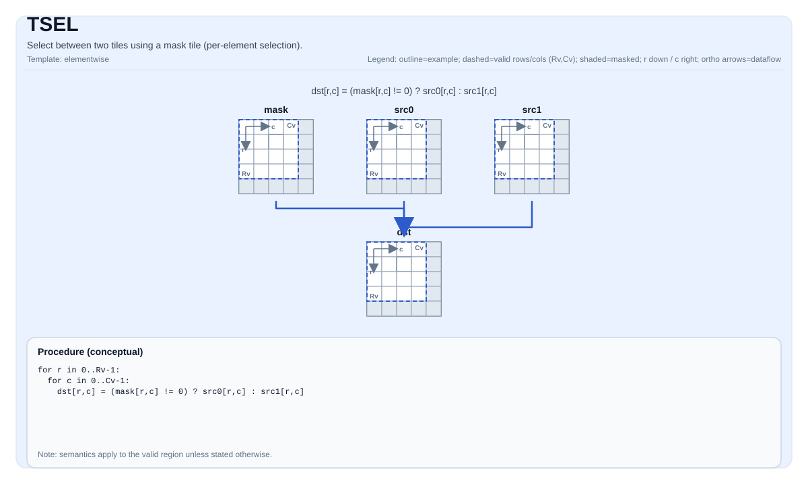

# TSEL

<!-- md-trans-meta sourceCommit=unknown translatedAt=2026-08-26T05:10:34.095Z pushedAt=2026-08-29T09:05:18.467Z -->

## Instruction Diagram



## Introduction

Selects between two tiles using a mask tile (element-wise selection).

## Mathematical Semantics

For each element `(i, j)` within the valid region:

$$
\mathrm{dst}_{i,j} =
\begin{cases}
\mathrm{src0}_{i,j} & \text{if } \mathrm{mask}_{i,j}\ \text{is true} \\
\mathrm{src1}_{i,j} & \text{otherwise}
\end{cases}
$$

## Assembly Syntax

Synchronous form:

```text
%dst = tsel %mask, %src0, %src1 : !pto.tile<...>
```

### AS Level 1 (SSA)

```text
%dst = pto.tsel %mask, %src0, %src1 : (!pto.tile<...>, !pto.tile<...>, !pto.tile<...>) -> !pto.tile<...>
```

### AS Level 2 (DPS)

```text
pto.tsel ins(%mask, %src0, %src1 : !pto.tile_buf<...>, !pto.tile_buf<...>, !pto.tile_buf<...>) outs(%dst : !pto.tile_buf<...>)
```

## C++ Built-in APIs

Declared in `include/pto/common/pto_instr.hpp`:
> The public include header is `<pto/pto-inst.hpp>`, and the internal declaration is located in `pto/common/pto_instr.hpp`.

```cpp
template <typename TileData, typename MaskTile, typename TmpTile, typename... WaitEvents>
PTO_INST RecordEvent TSEL(TileData &dst, MaskTile &selMask, TileData &src0, TileData &src1, TmpTile &tmp, WaitEvents &... events);
```

## Constraints

- **Implementation check (Atlas A2/A3 training products/Atlas A2/A3 inference products)**:
    - `sizeof(TileData::DType)` must be `2` or `4` bytes.
    - `TileData::DType` must be `int16_t`, `uint16_t`, `int32_t`, `uint32_t`, `half`, `bfloat16_t`, or `float`.
    - `dst`, `src0`, and `src1` must use the same element type.
    - `dst`, `src0`, and `src1` must be row-major.
    - The selection domain is determined by `dst.GetValidRow()`/`dst.GetValidCol()`.
- **Implementation check (Ascend 950PR/Ascend 950DT)**:
    - `sizeof(TileData::DType)` must be `1`, `2`, or `4` bytes.
    - `TileData::DType` must be `int8_t`, `uint8_t`, `int16_t`, `uint16_t`, `int32_t`, `uint32_t`, `half`, `bfloat16_t`, or `float`.
    - `dst`, `src0`, and `src1` must use the same element type.
    - `dst`, `src0`, and `src1` must be row-major.
    - The selection domain is determined by `dst.GetValidRow()`/`dst.GetValidCol()`.
- **Mask encoding**:
    - The mask tile is interpreted as packed predicate bits in the destination-defined layout.

## Temporary Space

### Atlas A2/A3 Training Products/Atlas A2/A3 Inference Products

`tmp` **is used** as a small buffer to hold the comparison mask (`cmpmask`) copied from the mask tile to each row. The implementation of Atlas A2/A3 training products/Atlas A2/A3 inference products uses `set_cmpmask`, which requires the mask data to be located at a specific UB position.

- The element type of `tmp` must be `uint32_t`.
- `tmp` size requirement: at least `cmpmaskLen` `uint32_t` elements per row, where `cmpmaskLen = 4` (16 bytes, 128 bits) for 16-bit data types (`half`, `bfloat16_t`), and `cmpmaskLen = 2` (8 bytes, 64 bits) for 32-bit data types (`float`, `int32_t`, `uint32_t`).
- Typical `tmp` tile declaration: `Tile<TileType::Vec, uint32_t, 1, 16>` satisfies most usage scenarios.

### Ascend 950PR/Ascend 950DT

`tmp` is accepted by the API but **not used** by the Ascend 950PR/Ascend 950DT implementation. The Ascend 950PR/Ascend 950DT backend uses vector-register-based mask operations (`plds`, `vsel`) and does not require temporary tile storage. `tmp` is retained in the C++ built-in API signature only for API compatibility with Atlas A2/A3 training products/Atlas A2/A3 inference products.

## Examples

### Automatic

```cpp
#include <pto/pto-inst.hpp>

using namespace pto;

void example_auto() {
  using TileT = Tile<TileType::Vec, float, 16, 16>;
  using MaskT = Tile<TileType::Vec, uint8_t, 16, 32, BLayout::RowMajor, -1, -1>;
  using TmpT = Tile<TileType::Vec, uint32_t, 1, 16>;
  TileT src0, src1, dst;
  MaskT mask(16, 2);
  TmpT tmp;
  TSEL(dst, mask, src0, src1, tmp);
}
```

### Manual

```cpp
#include <pto/pto-inst.hpp>

using namespace pto;

void example_manual() {
  using TileT = Tile<TileType::Vec, float, 16, 16>;
  using MaskT = Tile<TileType::Vec, uint8_t, 16, 32, BLayout::RowMajor, -1, -1>;
  using TmpT = Tile<TileType::Vec, uint32_t, 1, 16>;
  TileT src0, src1, dst;
  MaskT mask(16, 2);
  TmpT tmp;
  TASSIGN(src0, 0x1000);
  TASSIGN(src1, 0x2000);
  TASSIGN(dst,  0x3000);
  TASSIGN(mask, 0x4000);
  TASSIGN(tmp,  0x5000);
  TSEL(dst, mask, src0, src1, tmp);
}
```

## ASM Examples

### Automatic Mode

```text
# Automatic mode: the compiler/runtime handles resource placement and scheduling.
%dst = pto.tsel %mask, %src0, %src1 : (!pto.tile<...>, !pto.tile<...>, !pto.tile<...>) -> !pto.tile<...>
```

### Manual Mode

```text
# Manual mode: explicitly bind resources first, then issue the instruction.
# Optional (when the instruction contains tile operands):
# pto.tassign %arg0, @tile(0x1000)
# pto.tassign %arg1, @tile(0x2000)
%dst = pto.tsel %mask, %src0, %src1 : (!pto.tile<...>, !pto.tile<...>, !pto.tile<...>) -> !pto.tile<...>
```

### PTO Assembly Form

```text
%dst = tsel %mask, %src0, %src1 : !pto.tile<...>
# AS Level 2 (DPS)
pto.tsel ins(%mask, %src0, %src1 : !pto.tile_buf<...>, !pto.tile_buf<...>, !pto.tile_buf<...>) outs(%dst : !pto.tile_buf<...>)
```
