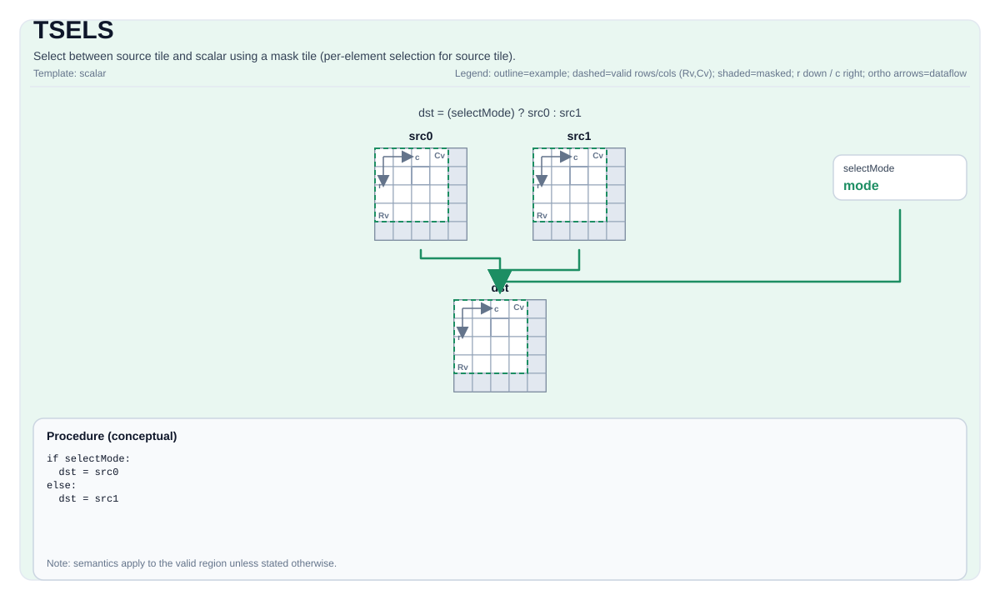

# TSELS

<!-- md-trans-meta sourceCommit=unknown translatedAt=2026-08-26T05:11:19.460Z pushedAt=2026-08-29T09:05:18.467Z -->

## Instruction Diagram



## Introduction

Performs element-wise selection between the source tile and a scalar using a mask tile.

## Mathematical Semantics

For each element `(i, j)` within the valid region:

$$
\mathrm{dst}_{i,j} =
\begin{cases}
\mathrm{src}_{i,j} & \text{if } \mathrm{mask}_{i,j}\ \text{is true} \\
\mathrm{scalar} & \text{otherwise}
\end{cases}
$$

## Assembly Syntax

Synchronous form:

```text
%dst = tsels %mask, %src, %scalar : !pto.tile<...>
```

### AS Level 1 (SSA)

```text
%dst = pto.tsels %mask, %src, %scalar : (!pto.tile<...>, !pto.tile<...>, dtype) -> !pto.tile<...>
```

### AS Level 2 (DPS)

```text
pto.tsels ins(%mask, %src, %scalar : !pto.tile_buf<...>, !pto.tile_buf<...>, dtype) outs(%dst : !pto.tile_buf<...>)
```

## C++ Built-in APIs

Declared in `include/pto/common/pto_instr.hpp`:
> The public include header is `<pto/pto-inst.hpp>`, and the internal declaration is located in `pto/common/pto_instr.hpp`.

```cpp
template <typename TileDataDst, typename TileDataMask, typename TileDataSrc, typename TileDataTmp, typename... WaitEvents>
PTO_INST RecordEvent TSELS(TileDataDst &dst, TileDataMask &mask, TileDataSrc &src, TileDataTmp &tmp, typename TileDataSrc::DType scalar, WaitEvents &... events);
```

## Constraints

- **Implementation check (Atlas A2/A3 training products/Atlas A2/A3 inference products)**:
    - `sizeof(TileDataDst::DType)` must be `2` or `4` bytes.
    - The supported data types are 2-byte or 4-byte types: `int16_t`, `uint16_t`, `int32_t`, `uint32_t`, `half`, `bfloat16_t`, `float`.
    - `dst` and `src` must use the same element type.
    - `dst` and `src` must be row-major.
    - Runtime: `src.GetValidRow()/GetValidCol()` must be consistent with `dst.GetValidRow()/GetValidCol()`.
- **Implementation check (Ascend 950PR/Ascend 950DT)**:
    - `sizeof(TileDataDst::DType)` can be `1`, `2`, or `4` bytes.
    - The supported data types are `int8_t`, `uint8_t`, `int16_t`, `uint16_t`, `int32_t`, `uint32_t`, `half`, and `float`.
    - `dst` and `src` must use the same element type.
    - `dst`, `mask`, and `src` must be row-major.
    - Runtime: `src.GetValidRow()/GetValidCol()` must be consistent with `dst.GetValidRow()/GetValidCol()`.
- **Valid region**:
    - This operation uses `dst.GetValidRow()`/`dst.GetValidCol()` as the iteration domain.
- **Mask encoding**:
    - The mask tile is interpreted as packed predicate bits in the destination-defined layout.

## Temporary Space

### Atlas A2/A3 Training Products/Atlas A2/A3 Inference Products

`tmp` **is used** as a small buffer to store the scalar value required by the `set_cmpmask` operation and to save the comparison mask. Before the selection loop, the scalar is written to `tmp[0]`.

- The element type of `tmp` must be consistent with `TileDataSrc::DType`.
- `tmp` size requirement: at least 1 element (for storing the scalar). Typical declaration: `Tile<TileType::Vec, float, 1, 16>` or similar.

### Ascend 950PR/Ascend 950DT

`tmp` is accepted by the API but is **not used** by the Ascend 950PR/Ascend 950DT implementation. The Ascend 950PR/Ascend 950DT backend uses `vdup` to broadcast the scalar to a vector register and `vsel` for selection, requiring no temporary tile storage. `tmp` is retained in the C++ built-in API signature only for API compatibility with Atlas A2/A3 training products/Atlas A2/A3 inference products.

## Examples

### Automatic

```cpp
#include <pto/pto-inst.hpp>

using namespace pto;

void example_auto() {
  using TileDst = Tile<TileType::Vec, float, 16, 16>;
  using TileSrc = Tile<TileType::Vec, float, 16, 16>;
  using TileTmp = Tile<TileType::Vec, float, 16, 16>;
  using TileMask = Tile<TileType::Vec, uint8_t, 16, 32, BLayout::RowMajor, -1, -1>;
  TileDst dst;
  TileSrc src;
  TileTmp tmp;
  TileMask mask(16, 2);
  float scalar = 0.0f;
  TSELS(dst, mask, src, tmp, scalar);
}
```

### Manual

```cpp
#include <pto/pto-inst.hpp>

using namespace pto;

void example_manual() {
  using TileDst = Tile<TileType::Vec, float, 16, 16>;
  using TileSrc = Tile<TileType::Vec, float, 16, 16>;
  using TileTmp = Tile<TileType::Vec, float, 16, 16>;
  using TileMask = Tile<TileType::Vec, uint8_t, 16, 32, BLayout::RowMajor, -1, -1>;
  TileDst dst;
  TileSrc src;
  TileTmp tmp;
  TileMask mask(16, 2);
  float scalar = 0.0f;
  TASSIGN(src, 0x1000);
  TASSIGN(tmp, 0x2000);
  TASSIGN(dst, 0x3000);
  TASSIGN(mask, 0x4000);
  TSELS(dst, mask, src, tmp, scalar);
}
```

## ASM Examples

### Automatic Mode

```text
# Automatic mode: the compiler/runtime handles resource placement and scheduling.
%dst = pto.tsels %mask, %src, %scalar : (!pto.tile<...>, !pto.tile<...>, dtype) -> !pto.tile<...>
```

### Manual Mode

```text
# Manual mode: explicitly bind resources first, then issue the instruction.
# Optional (when the instruction contains tile operands):
# pto.tassign %arg0, @tile(0x1000)
# pto.tassign %arg1, @tile(0x2000)
%dst = pto.tsels %mask, %src, %scalar : (!pto.tile<...>, !pto.tile<...>, dtype) -> !pto.tile<...>
```

### PTO Assembly Form

```text
%dst = tsels %mask, %src, %scalar : !pto.tile<...>
# AS Level 2 (DPS)
pto.tsels ins(%mask, %src, %scalar : !pto.tile_buf<...>, !pto.tile_buf<...>, dtype) outs(%dst : !pto.tile_buf<...>)
```
