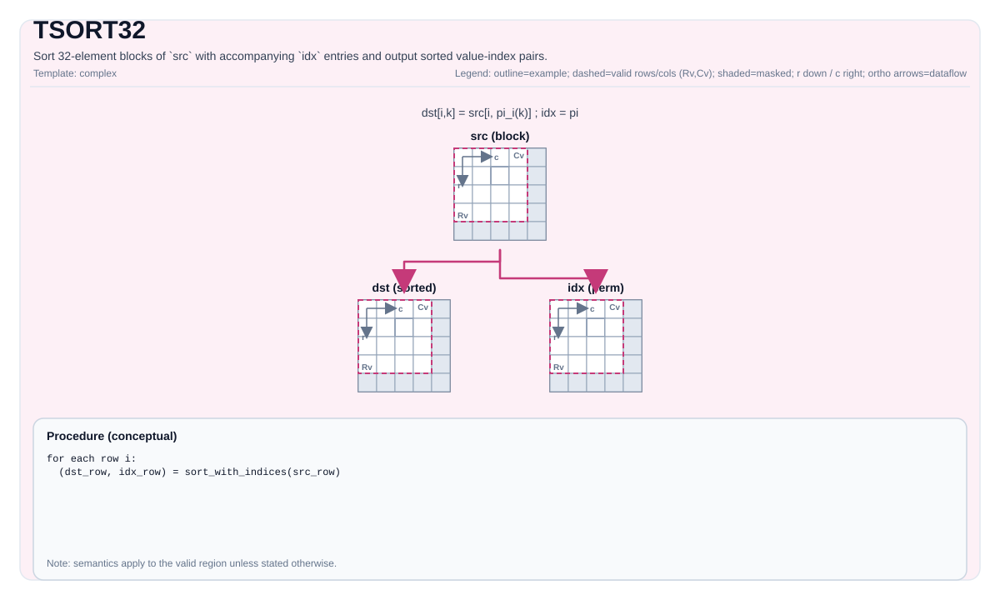

# TSort32

<!-- md-trans-meta sourceCommit=unknown translatedAt=2026-08-26T05:17:33.715Z pushedAt=2026-08-29T09:05:18.471Z -->

## Instruction Diagram



## Introduction

Sorts each 32-element block of `src` together with the corresponding index in `idx`, and writes the sorted value-index pairs to `dst`. The underlying SFU instruction is **VBS32** (`vbitsort`), which sorts one or more independent 32-element lists in a single call.

## Hardware: VBS32 (`vbitsort`)

VBS32 runs on the **SFU** (non-vector pipeline). A single call sorts `repeat` consecutive 32-element blocks, each consisting of 32 values + 32 indices, packed as value-index pairs:

```cpp
void vbitsort(__ubuf__ T *dst,        // Sorted value-index pair output
              __ubuf__ T *src0,        // 32 values per block × repeat
              __ubuf__ uint32_t *src1, // 32 indices per block × repeat
              uint8_t repeat);         // Number of 32-element blocks (1..255)
```

- `repeat` (upper limit `REPEAT_MAX = 255`) is packed into `config[63:56]`.
- Blocks are **contiguously distributed in memory with a stride of 32 elements**: block `b` reads `src0[b*32 : b*32+32]` and `src1[b*32 : b*32+32]`, and writes `dst[b*32*coef : ...]`, where `coef` = 2 (float) or 4 (half) — the expansion factor of the value-index pair.
- Sorting order: by value in **descending** order; for equal values, the smaller index takes precedence.

## Mathematical Semantics

For each row `r`, `src` is processed as independent 32-element blocks. Assume that block `b` covers columns `32b … 32b+31`, and `n_b = min(32, C - 32b)` is its number of valid elements.

$$
(v_k, i_k) = (\mathrm{src}_{r,32b+k},\; \mathrm{idx}_{r,32b+k}), \quad 0 \le k < n_b
$$

Sort in descending order by value, and output the rearranged sequence:

$$
[(v_{\pi(0)}, i_{\pi(0)}),\; (v_{\pi(1)}, i_{\pi(1)}),\; \ldots]
$$

Where `π` is the sorting permutation of the block.

Note:

- `idx` is an input tile (the indices are rearranged together with the values), not an output.
- `dst` stores the sorted value-index pairs, rather than only the sorted values.

## C++ Built-in APIs

Declared in `include/pto/common/pto_instr.hpp`:
> The public include header is `<pto/pto-inst.hpp>`, and the internal declaration is located in `pto/common/pto_instr.hpp`.

```cpp
// 3 parameters: src must be 32-aligned (validCol % 32 == 0)
template <typename DstTileData, typename SrcTileData, typename IdxTileData>
PTO_INST RecordEvent TSort32(DstTileData &dst, SrcTileData &src, IdxTileData &idx);

// 4 parameters: supports a non-32-aligned tail (validCol % 32 != 0), padded via tmp
template <typename DstTileData, typename SrcTileData, typename IdxTileData, typename TmpTileData>
PTO_INST RecordEvent TSort32(DstTileData &dst, SrcTileData &src, IdxTileData &idx, TmpTileData &tmp);
```

## Tile Size and Data Types

For a `src` shape of $R \times C$ (valid region) with a block size of 32:

| Tile | Dtype | Size (Number of Elements) | Description |
|------|-------|----------------|-------|
| `src` | `half` or `float` ($T$) | $R \times C$ | Values to be sorted |
| `idx` | `uint32_t` | $R \times C$ (or $1 \times C$ broadcast) | Indices reordered along with the values |
| `dst` | $T$ | $R \times (2C)$ float, $R \times (4C)$ half | Sorted value-index pairs (see expansion factor below) |
| `tmp` (4-parameter only) | $T$ | See tmp size formula below | Tail padding scratch |

**`dst` expansion factor** (`typeCoef`): each input element produces an 8-byte tuple `[value (4Byte), index (4Byte)]` — for `float`, the value occupies the full 4 bytes; for `half`, the 2-byte value is zero-extended to 4 bytes. Therefore, `dst` is always $C \times 8$ bytes.

| Dtype | Number of `dst` Columns per `src` Column (in Dtype Units) | Tuple layout | Bytes/Tuple |
|-------|-------------------------------------------|--------------|------------|
| `float` | ×2 (2 float slots) | `[value_f32, index_u32]` | 8 |
| `half` | ×4 (4 half slots) | `[value_f16, 0x0000, index_u32]` | 8 |

## Constraints

| Constraint | Reason |
|------------|------|
| `dst`/`src` dtype = `half` or `float` (must match); `idx` = `uint32_t` | VBS32 type dispatch |
| All tiles are `TileType::Vec`, `BLayout::RowMajor` | SFU addressing |
| `validCol % 32 == 0` (3-parameter) | Each block is exactly 32 elements |
| `validCol` arbitrary (4-parameter) | The tail block is padded to 32 via `tmp`, with padding value $-\infty$ |
| `repeat = validCol/32` (3-parameter) or `ceil(validCol/32)` (4-parameter) | VBS32 repeat count, at most 255 per call; larger `validCol` is split into multiple `vbitsort` calls |
| `tmp` (4-parameter) ≥ `tmpSize` elements (see formula below) | Stores the padded row/tail block copy |
| No `WaitEvents&...` / no internal `TSYNC` | Explicit synchronization is required if needed |

### `tmp` Size Formula (4-Parameter)

Assume $C$ = `validCol`, $B$ = `sizeof(T)` in bytes, and $G$ = 32 (block size). The implementation branches based on whether the full row size satisfies `MAX_UB_TMP = 8160` (Atlas A2/A3 training products/Atlas A2/A3 inference products use the number of elements, while Ascend 950PR/Ascend 950DT use bytes):

$$
\mathrm{tmpSize} =
\begin{cases}
\mathrm{ceil}_{G}(C) & \text{Atlas A2/A3 training products/Atlas A2/A3 inference products: } C \le 8160 \text{ (number of elements)} \;\; \text{ (Ascend 950PR/Ascend 950DT: } C \cdot b \le 8160 \text{ (bytes))} \\
G = 32 & \text{Atlas A2/A3 training products/Atlas A2/A3 inference products: } C > 8160 \text{ (number of elements)} \;\; \text{ (Ascend 950PR/Ascend 950DT: } C \cdot b > 8160 \text{ (bytes))}
\end{cases}
$$

- `ceil_G(C)` = $C$ rounded up to a multiple of 32.
- **Atlas A2/A3 training products/Atlas A2/A3 inference products**: the threshold unit is the **number of elements** (`srcShapeBytesPerRow / sizeof(T) <= MAX_UB_TMP`), that is, $C \le 8160$, independent of dtype (float → $C \le 8160$, half → $C \le 8160$).
- **Ascend 950PR/Ascend 950DT**: the threshold unit is **bytes** (`srcShapeBytesPerRow <= MAX_UB_TMP`), that is, $C \cdot b \le 8160$ (float → $C \le 2040$, half → $C \le 4080$). This threshold is the repeat upper limit of `pto_copy_ubuf_to_ubuf` (MOV_UB_TO_UB) = 255 blocks × 32Byte.
- The tail block = $t = C \bmod G$ elements (the incomplete block at the end), extended to $G$ and padded with $-\infty$.
- Path A ($C \cdot b \le 8160$, small row): copies the **entire row** from the row start to tmp, then pads the last 32 elements in place.
- Path B ($C \cdot b > 8160$, large row): copies only the **tail block** to tmp; complete blocks are sorted directly from `src`.
- VBS32 hardware limit: each call has `repeat ≤ REPEAT_MAX = 255` blocks (≤ 8160 elements); rows exceeding 255 blocks are split into multiple `vbitsort` calls.
- **UB layout:** `tmp` should be placed after `dst` (32Byte aligned), with a size of `ceil(C·b, 32)` bytes (equivalent to `ceil(ceil(C, 32)·b, 32)`, because $b \in \{2,4\}$ divides 32) — a fixed 8 KB offset should not be used, because Path A (Atlas A2/A3 training products/Atlas A2/A3 inference products) requires up to ~32 KB for float near the threshold ($C \le 8160$ elements = float 32KB).

### 4-Parameter Tail Processing

When `validCol % 32 != 0`, the incomplete block at the end ($t = C \bmod 32$ elements) must be padded into a complete 32-element block before being fed into `vbitsort`. Two paths:

- **Atlas A2/A3 training products/Atlas A2/A3 inference products: $C \le 8160$ (number of elements)** / **Ascend 950PR/Ascend 950DT: $C \cdot b \le 8160$ (bytes)** (small row): copy the **entire row** to `tmp`, then overwrite the last 32 elements in place with $-\infty$ padding via `vdup`; sort the entire row from `tmp`.
- **Atlas A2/A3 training products/Atlas A2/A3 inference products: $C > 8160$ (number of elements)** / **Ascend 950PR/Ascend 950DT: $C \cdot b > 8160$ (bytes)** (large row): copy only the **tail block** to `tmp` and pad it; sort complete blocks directly from `src`, and sort only the tail block from `tmp`.

The padding value ($-\infty$ = `-1.0/0.0` or `std::numeric_limits<T>::lowest()`) falls at the bottom of the descending sort. If `validCol > 32 × 255`, the row is split into groups of `REPEAT_MAX` size, and each group is sorted by an independent `vbitsort` call.

## Assembly Syntax

### AS Level 1 (SSA)

```text
%dst = pto.tsort32 %src, %idx : (!pto.tile<...>, !pto.tile<...>) -> !pto.tile<...>
```

### AS Level 2 (DPS)

```text
pto.tsort32 ins(%src, %idx : !pto.tile_buf<...>, !pto.tile_buf<...>) outs(%dst : !pto.tile_buf<...>)
```

## Examples

```cpp
#include <pto/pto-inst.hpp>
using namespace pto;

// 32-aligned: one block per row.
using SrcT = Tile<TileType::Vec, float, 1, 32>;
using IdxT = Tile<TileType::Vec, uint32_t, 1, 32>;
using DstT = Tile<TileType::Vec, float, 1, 64>;   // 2x src columns (float).
SrcT src; IdxT idx; DstT dst;
TSort32(dst, src, idx);

// Non-32-aligned tail: 4 parameters + tmp.
using SrcT2 = Tile<TileType::Vec, half, 1, 100>;
using IdxT2 = Tile<TileType::Vec, uint32_t, 1, 100>;
using DstT2 = Tile<TileType::Vec, half, 1, 400>;  // 4x src columns (half).
using TmpT  = Tile<TileType::Vec, half, 1, 128>;  // ≥ ceil32(100)=128
TSort32(dst2, src2, idx2, tmp);
```

## ASM Examples

### Automatic Mode

```text
%dst = pto.tsort32 %src, %idx : (!pto.tile<...>, !pto.tile<...>) -> !pto.tile<...>
```

### Manual Mode

```text
# pto.tassign %arg0, @tile(0x1000)
# pto.tassign %arg1, @tile(0x2000)
# pto.tassign %arg2, @tile(0x3000)
%dst = pto.tsort32 %src, %idx : (!pto.tile<...>, !pto.tile<...>) -> !pto.tile<...>
```

### PTO Assembly Form

```text
%dst = tsort32 %src, %idx : (!pto.tile<...>, !pto.tile<...>) -> !pto.tile<...>
# AS Level 2 (DPS)
pto.tsort32 ins(%src, %idx : !pto.tile_buf<...>, !pto.tile_buf<...>) outs(%dst : !pto.tile_buf<...>)
```
