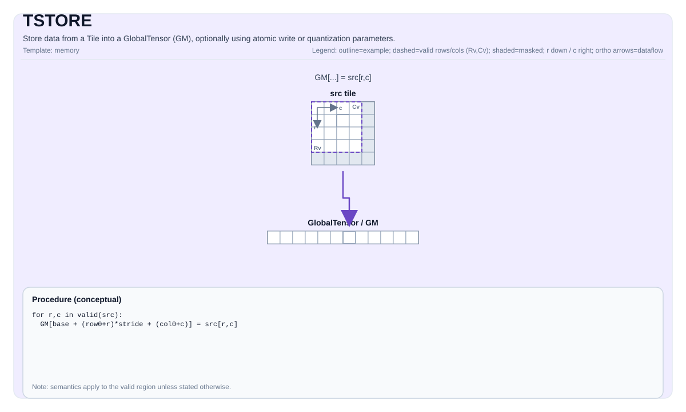

# TSTORE

## 指令示意图



## 简介

将Tile中的数据存储到GlobalTensor (GM)，可选使用原子写入或量化参数。

## 数学语义

符号表示取决于 `GlobalTensor` 的形状/步长和 `Tile` 的布局。概念上（二维视图，带基础偏移量）：

$$ \mathrm{dst}_{r_0 + i,\; c_0 + j} = \mathrm{src}_{i,j} $$

## 汇编语法

同步形式：

```text
tstore %t1, %sv_out[%c0, %c0]
```

### AS Level 1（SSA）

```text
pto.tstore %src, %mem : (!pto.tile<...>, !pto.partition_tensor_view<MxNxdtype>) -> ()
```

### AS Level 2（DPS）

```text
pto.tstore ins(%src : !pto.tile_buf<...>) outs(%mem : !pto.partition_tensor_view<MxNxdtype>)
```

## C++内建接口

声明于 `include/pto/common/pto_instr.hpp` 和 `include/pto/common/constants.hpp`：
> 公共包含头为 `<pto/pto-inst.hpp>`，内部声明位于 `pto/common/pto_instr.hpp`。

```cpp
template <typename TileData, typename GlobalData, AtomicType atomicType = AtomicType::AtomicNone,
          typename... WaitEvents>
PTO_INST RecordEvent TSTORE(GlobalData& dst, TileData& src, WaitEvents&... events);

template <typename TileData, typename GlobalData, AtomicType atomicType = AtomicType::AtomicNone,
          typename... WaitEvents>
PTO_INST RecordEvent TSTORE(GlobalData& dst, TileData& src, uint64_t preQuantScalar, WaitEvents&... events);

template <typename TileData, typename GlobalData, typename FpTileData, AtomicType atomicType = AtomicType::AtomicNone,
          ReluPreMode reluPreMode = ReluPreMode::NoRelu, typename... WaitEvents>
PTO_INST RecordEvent TSTORE(GlobalData& dst, TileData& src, FpTileData& fp, WaitEvents&... events);

template <typename TileData, typename GlobalData, typename FpTileData, AtomicType atomicType = AtomicType::AtomicNone,
          ReluPreMode reluPreMode = ReluPreMode::NoRelu, typename... WaitEvents>
PTO_INST RecordEvent TSTORE_FP(GlobalData& dst, TileData& src, FpTileData& fp, WaitEvents&... events);
```

`TSTORE_FP(...)` 为历史 fp 量化形式保留源码兼容入口，并直接映射到 `TSTORE_IMPL(dst, src, fp)`。
规范同名 `TSTORE(..., fp, ...)` 重载仅在 `FpTileData::Loc == TileType::Scaling` 时参与匹配；
后端实现仍可继续检查额外合法性。

搬出侧 `STPhase` 的取值规则与累加侧不对称：产生该 L0C 结果的 `TMATMUL` 必须已经是
`AccPhase::Final`，即数据已就绪；`STPhase::Final` 用于最后一次搬出并释放 unit flag；
`STPhase::Partial` 只用于同一块 L0C 分多次搬出时的非末次那几条，它不释放 unit flag。
把 `STPhase::Partial` 与 `AccPhase::Partial` 配对会让 fixpipe 等待一个不会到来的标志而挂死。

该规则已在 L0C→L1、L0C→UB、L0C→GM 三条搬出路径上于 Ascend 950PR 仿真测试确认，
其中 `TSTORE` 走的是 L0C→GM 的 `copy_matrix_cc_to_gm`（unit flag 写在 Xt 寄存器而非位置参数），
由 `tstore_acc2gm` 的 `case_vector_quant_uf_multi_drain` 覆盖。

在 Ascend 950PR 板机、CANN 9.2.0 环境下，`tstore_acc2gm` 的 3 个定向用例
（`case38`、`case_vector_quant_uf_final`、`case_vector_quant_uf_multi_drain`）全部通过，max diff 均为 0，
覆盖 per-channel 量化基线、`Final` 和 `Partial` 后接 `Final`。
连同 TEXTRACT、TINSERT 和 TMOV，本轮 24 个定向搬出用例全部上板通过；
该结果仅覆盖所选用例，不代表完整 A5 ST 测试集。

向量量化 `STPhase` 形式仅在存在对应后端实现的目标上暴露
（A2A3、A5、kirin9030、kirinDev0000 和 CPU 模拟器）。

## L2 cache hint

可选首模板参数 `TStoreL2Hint l2Control`（默认 `NormalFirstVictim`）：

```cpp
TSTORE(dst, src);
TSTORE<TStoreL2Hint::NotAllocClean>(dst, src);
TSTORE<TStoreL2Hint::NotAllocClean, AtomicType::AtomicAdd>(dst, src);
```

与 `AtomicType` / `STPhase` / `ReluPreMode` 组合时，`TStoreL2Hint` 放在最前。不要在旧重载集的 `TileData` 前插入默认 hint。

支持的 `TStoreL2Hint`：

| 枚举 | 值 | A2/A3 | A5 |
| --- | --- | --- | --- |
| NormalFirstVictim | 0 | 无效果 | 支持 |
| NormalLastVictim | 1 | 无效果 | 支持 |
| NormalPersistent | 2 | 无效果 | 支持 |
| NotAllocClean | 4 | 无效果 | 支持 |

A2/A3 上 L2 hint **无效果**（所有取值均为 no-op；无 store L2 控制）。A5 上表内取值透传给 DMA。CPU / costmodel 忽略。

## 约束

- **实现检查 （Atlas A2/A3 训练系列产品/Atlas A2/A3 推理系列产品）**:
    - 源tile位置必须是以下之一：`TileType::Vec`、`TileType::Mat`、`TileType::Acc`。
    - 运行时：所有 `dst.GetShape(dim)` 值和 `src.GetValidRow()/GetValidCol()` 必须 `> 0`。
    - 对于源tile位置为 `TileType::Vec` / `TileType::Mat`：
        - `TileData::DType` 必须是以下之一：`int8_t`、`uint8_t`、`int16_t`、`uint16_t`、`int32_t`、`uint32_t`、`int64_t`、`uint64_t`、`half`、`bfloat16_t`、`float`。
        - `sizeof(TileData::DType) == sizeof(GlobalData::DType)`。
        - 布局必须匹配ND/DN/NZ（或特殊情况：`TileData::Rows == 1` 或 `TileData::Cols == 1`）。
      该特殊情况下遍历方式取自 Tile 布局而非 `GlobalTensor` 布局：向量按一次连续搬运写入，不使用另一维的跨距。
      因此 ColMajor 的 `[N, 1]` Tile 经 ND `GlobalTensor` 落盘时占用 `N` 个连续元素，而不是每行跨距一个元素。
        - 对于 `int64_t/uint64_t`，仅支持ND->ND或DN->DN。
    - 对于源tile位置为`TileType::Acc`（包括带量化参数的调用形式和原子写入变体）：
        - 支持的布局转换：NZ2ND、NZ2NZ、NZ2NC1HWC0、NZ2NDC1HWC0。不支持NZ2DN。
        - 目标布局必须是ND、NZ、NC1HWC0或NDC1HWC0。
        - 源数据类型必须是 `int32_t` 或 `float`。
        - 不使用量化时，目标数据类型必须是 `int32_t/float/half/bfloat16_t`。
        - ACC到GM的数据类型支持取决于调用形式：

          | 调用形式 | 源数据类型 | 支持的目标数据类型 |
          | --- | --- | --- |
          | `TSTORE(dst, acc)` | `float` | `float`、`half`、`bfloat16_t` |
          | `TSTORE(dst, acc)` | `int32_t` | `int32_t` |
          | `TSTORE(dst, acc, preQuantScalar)` / `TSTORE(dst, acc, fp)` / `TSTORE_FP(dst, acc, fp)` | `float` | `int8_t`、`uint8_t` |
          | `TSTORE(dst, acc, preQuantScalar)` / `TSTORE(dst, acc, fp)` / `TSTORE_FP(dst, acc, fp)` | `int32_t` | `int8_t`、`uint8_t`、`half` |

          其它未列出的跨类型组合不属于支持范围。

        - 静态形状约束：`1 <= TileData::Cols <= 4095`；如果是ND则 `1 <= TileData::Rows <= 8192`；如果是NZ、NC1HWC0或NDC1HWC0则 `1 <= TileData::Rows <= 65535` 且 `TileData::Cols % 16 == 0`。
        - 运行时：`1 <= src.GetValidCol() <= 4095`。
- **实现检查 (Ascend 950PR/Ascend 950DT)**:
    - 源tile位置必须是 `TileType::Vec` 或 `TileType::Acc`（此目标不支持 `Mat` 存储）。
    - 对于源tile位置为 `TileType::Vec`：
        - `sizeof(TileData::DType) == sizeof(GlobalData::DType)`。
        - `TileData::DType` 必须是以下之一：`int8_t`、`uint8_t`、`int16_t`、`uint16_t`、`int32_t`、`uint32_t`、`int64_t`、`uint64_t`、`half`、`bfloat16_t`、`float`、`float8_e4m3_t`、`float8_e5m2_t`、`hifloat8_t`、`float8_e8m0_t`、`float4_e1m2x2_t`、`float4_e2m1x2_t`。
        - 布局必须匹配ND/DN/NZ（或特殊情况：`TileData::Rows == 1` 或 `TileData::Cols == 1`）。
      该特殊情况下遍历方式取自 Tile 布局而非 `GlobalTensor` 布局：向量按一次连续搬运写入，不使用另一维的跨距。
      因此 ColMajor 的 `[N, 1]` Tile 经 ND `GlobalTensor` 落盘时占用 `N` 个连续元素，而不是每行跨距一个元素。
        - 强制执行额外的对齐约束（例如，对于ND，行主序宽度（以字节为单位）必须是32的倍数；对于DN，列主序高度（以字节为单位）必须是32的倍数，但有特殊情况例外）。
    - 对于源tile位置为`TileType::Acc`（包括带量化参数的调用形式和原子写入变体）：
        - 支持的布局转换：NZ2ND、NZ2NZ、NZ2NHWC、NZ2NCHW、NZ2NCDHW。不支持NZ2DN。
        - 目标布局必须是ND、NZ、NHWC、NCHW或NCDHW；源数据类型必须是 `int32_t` 或 `float`。
        - 不使用量化时，目标数据类型必须是 `int32_t/float/half/bfloat16_t`。
        - ACC到GM的数据类型支持取决于调用形式：

          | 调用形式 | 源数据类型 | 支持的目标数据类型 |
          | --- | --- | --- |
          | `TSTORE(dst, acc)` | `float` | `float`、`half`、`bfloat16_t` |
          | `TSTORE(dst, acc)` | `int32_t` | `int32_t` |
          | `TSTORE(dst, acc, preQuantScalar)` / `TSTORE(dst, acc, fp)` / `TSTORE_FP(dst, acc, fp)` | `float` | `int8_t`、`uint8_t`、`half`、`bfloat16_t`、`hifloat8_t`、`float8_e4m3_t`、`float` |
          | `TSTORE(dst, acc, preQuantScalar)` / `TSTORE(dst, acc, fp)` / `TSTORE_FP(dst, acc, fp)` | `int32_t` | `int8_t`、`uint8_t`、`half`、`bfloat16_t` |

          其它未列出的跨类型组合不属于支持范围。

        - 静态形状约束与Atlas A2/A3 训练系列产品/Atlas A2/A3 推理系列产品对于行/列的约束相同；`AtomicAdd` 额外限制目标数据类型为支持的原子类型。
- **有效区域**:
    - 实现使用 `src.GetValidRow()` / `src.GetValidCol()` 作为传输大小。

## 示例

### 自动（Auto）

```cpp
#include <pto/pto-inst.hpp>

using namespace pto;

template <typename T>
void example_auto(__gm__ T* out) {
  using TileT = Tile<TileType::Vec, T, 16, 16>;
  using GShape = Shape<1, 1, 1, 16, 16>;
  using GStride = BaseShape2D<T, 16, 16, Layout::ND>;
  using GTensor = GlobalTensor<T, GShape, GStride, Layout::ND>;

  GTensor gout(out);
  TileT t;
  TSTORE(gout, t);
}
```

### 手动（Manual）

```cpp
#include <pto/pto-inst.hpp>

using namespace pto;

template <typename T>
void example_manual(__gm__ T* out) {
  using TileT = Tile<TileType::Vec, T, 16, 16>;
  using GShape = Shape<1, 1, 1, 16, 16>;
  using GStride = BaseShape2D<T, 16, 16, Layout::ND>;
  using GTensor = GlobalTensor<T, GShape, GStride, Layout::ND>;

  GTensor gout(out);
  TileT t;
  TASSIGN(t, 0x1000);
  TSTORE<TileT, GTensor, AtomicType::AtomicAdd>(gout, t);
}
```

## 汇编示例（ASM）

### 自动模式

```text
# 自动模式：由编译器/运行时负责资源放置与调度。
pto.tstore %src, %mem : (!pto.tile<...>, !pto.partition_tensor_view<MxNxdtype>) -> ()
```

### 手动模式

```text
# 手动模式：先显式绑定资源，再发射指令。
# 可选（当该指令包含 tile 操作数时）：
# pto.tassign %arg0, @tile(0x1000)
# pto.tassign %arg1, @tile(0x2000)
pto.tstore %src, %mem : (!pto.tile<...>, !pto.partition_tensor_view<MxNxdtype>) -> ()
```

### PTO汇编形式

```text
tstore %t1, %sv_out[%c0, %c0]
# AS Level 2 (DPS)
pto.tstore ins(%src : !pto.tile_buf<...>) outs(%mem : !pto.partition_tensor_view<MxNxdtype>)
```
