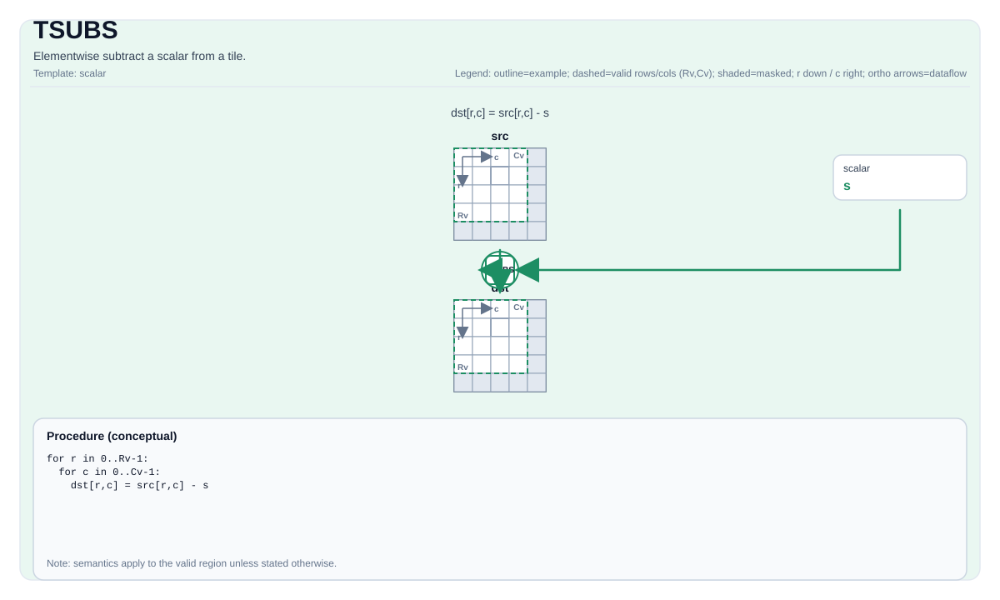

# TSUBS

<!-- md-trans-meta sourceCommit=unknown translatedAt=2026-08-26T05:20:47.266Z pushedAt=2026-08-29T09:05:18.473Z -->

## Instruction Diagram



## Introduction

Subtracts a scalar from each element in the tile.

## Mathematical Semantics

For each element `(i, j)` in the valid region:

$$ \mathrm{dst}_{i,j} = \mathrm{src}_{i,j} - \mathrm{scalar} $$

## Assembly Syntax

Synchronous form:

```text
%dst = tsubs %src, %scalar : !pto.tile<...>, f32
```

### AS Level 1 (SSA)

```text
%dst = pto.tsubs %src, %scalar : (!pto.tile<...>, dtype) -> !pto.tile<...>
```

### AS Level 2 (DPS)

```text
pto.tsubs ins(%src, %scalar : !pto.tile_buf<...>, dtype) outs(%dst : !pto.tile_buf<...>)
```

## C++ Built-in APIs

Declared in `include/pto/common/pto_instr.hpp`:
> The public include header is `<pto/pto-inst.hpp>`, and the internal declaration is located in `pto/common/pto_instr.hpp`.

```cpp
template <typename TileDataDst, typename TileDataSrc, typename... WaitEvents>
PTO_INST RecordEvent TSUBS(TileDataDst &dst, TileDataSrc &src0, typename TileDataSrc::DType scalar, WaitEvents &... events);
```

## Constraints

- **Implementation check (Atlas A2/A3 training products/Atlas A2/A3 inference products)**:
    - `TileData::DType` must be one of the following: `int32_t`, `int`, `int16_t`, `half`, `float16_t`, `float`, `float32_t`.
    - The tile position must be a vector (`TileData::Loc == TileType::Vec`).
    - Runtime: `src0.GetValidRow() == dst.GetValidRow()` and `src0.GetValidCol() == dst.GetValidCol()`.
- **Implementation check (Ascend 950PR/Ascend 950DT)**:
    - `TileData::DType` must be one of the following: `uint8_t`, `int8_t`, `uint16_t`, `int16_t`, `uint32_t`, `int32_t`, `half`, `float`, `bfloat16_t`.
    - The tile position must be a vector (`TileDataDst::Loc == TileType::Vec` and `TileDataSrc::Loc == TileType::Vec`).
    - Static valid boundary: `TileDataDst::ValidRow <= TileDataDst::Rows`, `TileDataDst::ValidCol <= TileDataDst::Cols`, `TileDataSrc::ValidRow <= TileDataSrc::Rows`, and `TileDataSrc::ValidCol <= TileDataSrc::Cols`.
    - Runtime: `src0.GetValidRow() == dst.GetValidRow()` and `src0.GetValidCol() == dst.GetValidCol()`.
- **General constraints**:
    - `dst` and `src0` must use the same element type.
    - The scalar type must match `TileDataSrc::DType`.
- **Valid region**:
    - This operation uses `dst.GetValidRow()`/`dst.GetValidCol()` as the iteration domain.

## Examples

```cpp
#include <pto/pto-inst.hpp>

using namespace pto;

void example() {
  using TileT = Tile<TileType::Vec, float, 16, 16>;
  TileT x, out;
  TSUBS(out, x, 1.0f);
}
```

## ASM Examples

### Automatic Mode

```text
# Automatic mode: the compiler/runtime handles resource placement and scheduling.
%dst = pto.tsubs %src, %scalar : (!pto.tile<...>, dtype) -> !pto.tile<...>
```

### Manual Mode

```text
# Manual mode: explicitly bind resources first, then issue the instruction.
# Optional (when the instruction contains tile operands):
# pto.tassign %arg0, @tile(0x1000)
# pto.tassign %arg1, @tile(0x2000)
%dst = pto.tsubs %src, %scalar : (!pto.tile<...>, dtype) -> !pto.tile<...>
```

### PTO Assembly Form

```text
%dst = tsubs %src, %scalar : !pto.tile<...>, f32
# AS Level 2 (DPS)
pto.tsubs ins(%src, %scalar : !pto.tile_buf<...>, dtype) outs(%dst : !pto.tile_buf<...>)
```
