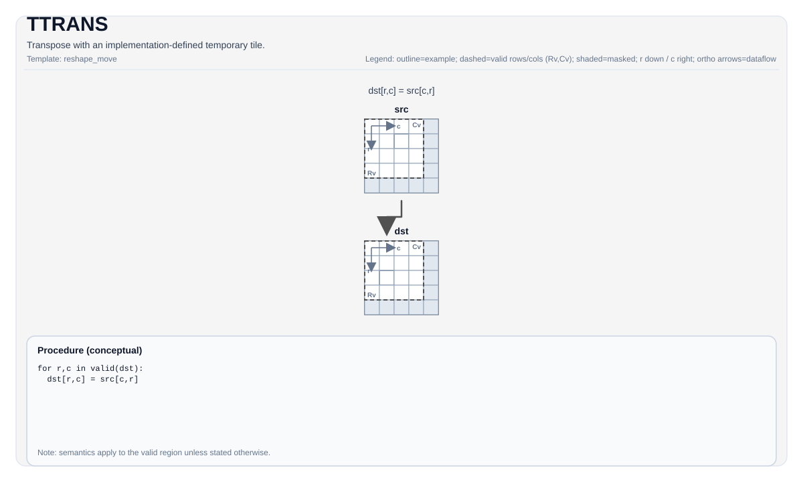

# TTRANS

<!-- md-trans-meta sourceCommit=unknown translatedAt=2026-08-26T05:22:33.567Z pushedAt=2026-08-29T09:05:18.474Z -->

## Instruction Diagram



## Introduction

Performs a transpose using an implementation-defined temporary tile.

## Mathematical Semantics

For a two-dimensional tile and over the valid transpose domain:

$$ \mathrm{dst}_{i,j} = \mathrm{src}_{j,i} $$

The exact shape/layout and the transpose domain depend on the target hardware (see Constraints).

## Assembly Syntax

Synchronous form:

```text
%dst = ttrans %src : !pto.tile<...> -> !pto.tile<...>
```

The compiler lowering phase may introduce an internal temporary tile; the C++ built-in APIs require an explicit `tmp` operand.

### AS Level 1 (SSA)

```text
%dst = pto.ttrans %src : !pto.tile<...> -> !pto.tile<...>
```

### AS Level 2 (DPS)

```text
pto.ttrans ins(%src : !pto.tile_buf<...>) outs(%dst : !pto.tile_buf<...>)
```

## C++ Built-in APIs

Declared in `include/pto/common/pto_instr.hpp`:
> The public include header is `<pto/pto-inst.hpp>`, and the internal declaration is located in `pto/common/pto_instr.hpp`.

```cpp
template <typename TileDataDst, typename TileDataSrc, typename TileDataTmp, typename... WaitEvents>
PTO_INST RecordEvent TTRANS(TileDataDst &dst, TileDataSrc &src, TileDataTmp &tmp, WaitEvents &... events);
```

## Constraints

- **Implementation check (Atlas A2/A3 training products/Atlas A2/A3 inference products)**:
    - `sizeof(TileDataSrc::DType) == sizeof(TileDataDst::DType)`.
    - The source layout must be row-major (`TileDataSrc::isRowMajor`).
    - The element size must be `1`, `2`, or `4` bytes.
    - Supported element types are restricted by element width as follows:
    - 4 bytes: `uint32_t`, `int32_t`, `float`
    - 2 bytes: `uint16_t`, `int16_t`, `half`, `bfloat16_t`
    - 1 byte: `uint8_t`, `int8_t`
    - The transpose size is taken from `src.GetValidRow()`/`src.GetValidCol()`.
- **Implementation check (Ascend 950PR/Ascend 950DT)**:
    - `sizeof(TileDataSrc::DType) == sizeof(TileDataDst::DType)`.
    - A 32-byte alignment constraint is enforced on the major dimension of the input and output (row-major checks `Cols * sizeof(T) % 32 == 0`, column-major checks `Rows * sizeof(T) % 32 == 0`).
    - Supported element types are limited by element width as follows:
    - 4 bytes: `uint32_t`, `int32_t`, `float`
    - 2 bytes: `uint16_t`, `int16_t`, `half`, `bfloat16_t`
    - 1 byte: `uint8_t`, `int8_t`
    - The transpose size is taken from `src.GetValidRow()`/`src.GetValidCol()`.
- **Temporary tile**:
    - The C++ API requires `tmp`. The required tmp space size is calculated as follows:
    - **Basic parameters**:
        - RowStride: 32 for the b8 type and 16 for the b16/b32 types (corresponding to Y_ELEM_B8 and Y_ELEM_OTHER)
        - ElemPerBlock: 32/sizeof(T), that is, the number of elements per 32-byte block
        - Where b8 is uint8_t/int8_t, b16 is uint16_t/int16_t/half/bfloat16_t, and b32 is uint32_t/int32_t/float
    - **Alignment conditions**:
        - When the stride satisfies the alignment requirements (dstStride % RowStride == 0, srcStride % ElemPerBlock == 0, srcStride/ElemPerBlock <= 255), tmp is used for efficient transpose; otherwise, scalar copy is used and tmp is not required.
    - **2D tile transpose [H, W] -> [W, H]**:
        $$ \text{tmpSize} = W \times \lceil\frac{H}{\text{RowStride}}\rceil \times \text{RowStride} \times \text{sizeof(DType)} $$
        Where W is the number of columns (validCol) and H is the number of rows (validRow). tmpStride must be aligned to RowStride. tmp is required only when the stride satisfies the alignment conditions.
    - **NCHW <-> NC1HWC0 bidirectional conversion**:
        - **Forward [N, C, H, W] -> [N, C1, H, W, C0]**:
        $$ \text{tmpSize} = H \times W \times \lceil\frac{C0}{\text{RowStride}}\rceil \times \text{RowStride} \times \text{sizeof(DType)} $$
        Where C1 = (C + C0 - 1) / C0, and the transpose domain is C0 rows and H*W columns.
        - **Reverse [N, C1, H, W, C0] -> [N, C, H, W]**:
        $$ \text{tmpSize} = C0 \times \lceil\frac{H \times W}{\text{RowStride}}\rceil \times \text{RowStride} \times \text{sizeof(DType)} $$
        The transpose domain is H*W rows and C0 columns.
    - **GNCHW <-> GNC1HWC0 bidirectional conversion**:
        - **Forward [G, N, C, H, W] -> [G, N, C1, H, W, C0]**:
        $$ \text{tmpSize} = H \times W \times \lceil\frac{C0}{\text{RowStride}}\rceil \times \text{RowStride} \times \text{sizeof(DType)} $$
        Where C1 = (C + C0 - 1) / C0, and the transpose domain is C0 rows and H*W columns.
        - **Reverse [G, N, C1, H, W, C0] -> [G, N, C, H, W]**:
        $$ \text{tmpSize} = C0 \times \lceil\frac{H \times W}{\text{RowStride}}\rceil \times \text{RowStride} \times \text{sizeof(DType)} $$
        The transpose domain is H*W rows and C0 columns.
    - **NC1HWC0 -> FRACTAL_Z and GNC1HWC0 -> FRACTAL_Z**:
        - These two conversions do not require tmp space and directly perform a memory rearrangement operation.
    - **NCDHW to Fractal_Z_3D [N, C, D, H, W] -> [D, C1, H, W, N1, N0, C0]**:
        $$ \text{tmpSize} = (N \times C1 \times C0 \times H \times W + \max(N \times C1 \times C0 \times H \times W, H \times W \times \lceil\frac{C0}{\text{RowStride}}\rceil \times \text{RowStride})) \times \text{sizeof(DType)} $$
        where C1 = (C + C0 - 1) / C0 and N1 = (N + N0 - 1) / N0. RowStride is 32 for 8-bit data and 16 for 16/32-bit data. This conversion is performed in two stages with different execution paths: the first stage extracts the d-plane of NCDHW into NCHW format (requiring N*C1*C0*H*W space as planePtr), and the second stage either writes the result to secondPtr (requiring N*C1*C0*H*W) or uses secondPtr as the temporary buffer for the transpose (requiring H*W*ceil(C0/RowStride)*RowStride). Because the path is selected at runtime, secondPtr requires the maximum of the two.
- **ConvTile**:
    - Supports format conversion of ConvTile on `TileType::Vec`. Its element size must be `1`, `2`, or `4` bytes. The element types are limited to `uint32_t`, `int32_t`, `float`, `uint16_t`, `int16_t`, `half`, `bfloat16_t`, `uint8_t`, and `int8_t`.
    - Supports the transformation of ConvTile from `NCHW` to `NC1HWC0`, where `C1 == (C + C0 - 1)/C0` and HW satisfies the alignment requirement, that is, `H*W*sizeof(T)%32==0`. C0 corresponds to `c0_size`, that is, `C0 * sizeof(T) == 32`. C0 can also be 4.
    - Supports the transformation of ConvTile from `NC1HWC0` to `FRACTAL_Z`, where `N1 == (N + N0 - 1)/N0`. N0 is 16.
    - Supports the transformation of ConvTile from `NCDHW` to `FRACTAL_Z_3D`, with the target shape `[D * C1 * H * W, N1, N0, C0]`, where `C1 == (C + C0 - 1)/C0` and `N1 == (N + N0 - 1)/N0`. `N0` is 16. `C0` depends on the element width: 64 for 4-bit data, 32 for 8-bit data, 16 for 16-bit data, and 8 for 32-bit data. For the temporary Tile size calculation formula, see the **Temporary Tile** section above.

## Examples

### Automatic

```cpp
#include <pto/pto-inst.hpp>

using namespace pto;

void example_auto() {
  using SrcT = Tile<TileType::Vec, float, 16, 16>;
  using DstT = Tile<TileType::Vec, float, 16, 16>;
  using TmpT = Tile<TileType::Vec, float, 16, 16>;
  SrcT src;
  DstT dst;
  TmpT tmp;
  TTRANS(dst, src, tmp);
}
```

### Manual

```cpp
#include <pto/pto-inst.hpp>

using namespace pto;

void example_manual() {
  using SrcT = Tile<TileType::Vec, float, 16, 16>;
  using DstT = Tile<TileType::Vec, float, 16, 16>;
  using TmpT = Tile<TileType::Vec, float, 16, 16>;
  SrcT src;
  DstT dst;
  TmpT tmp;
  TASSIGN(src, 0x1000);
  TASSIGN(dst, 0x2000);
  TASSIGN(tmp, 0x3000);
  TTRANS(dst, src, tmp);
}
```

## ASM Examples

### Automatic Mode

```text
# Automatic mode: the compiler/runtime is responsible for resource placement and scheduling.
%dst = pto.ttrans %src : !pto.tile<...> -> !pto.tile<...>
```

### Manual Mode

```text
# Manual mode: explicitly bind resources first, then issue the instruction.
# Optional (when the instruction contains tile operands):
# pto.tassign %arg0, @tile(0x1000)
# pto.tassign %arg1, @tile(0x2000)
%dst = pto.ttrans %src : !pto.tile<...> -> !pto.tile<...>
```

### PTO Assembly Form

```text
%dst = ttrans %src : !pto.tile<...> -> !pto.tile<...>
# AS Level 2 (DPS)
pto.ttrans ins(%src : !pto.tile_buf<...>) outs(%dst : !pto.tile_buf<...>)
```
