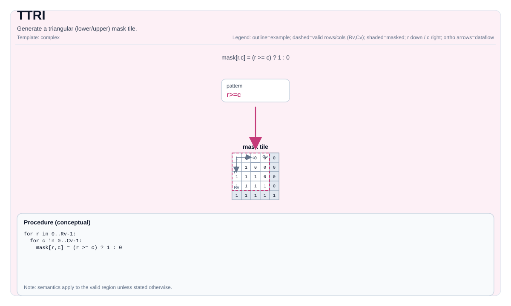

# TTRI

<!-- md-trans-meta sourceCommit=unknown translatedAt=2026-08-26T05:23:29.081Z pushedAt=2026-08-29T09:05:18.474Z -->

## Instruction Diagram



## Introduction

Generates a triangular (lower/upper) mask tile.

## Mathematical Semantics

Assume `R = dst.GetValidRow()`, `C = dst.GetValidCol()`, and `d = diagonal`.

The lower triangular (`isUpperOrLower=0`) conceptually produces:

$$
\mathrm{dst}_{i,j} = \begin{cases}1 & j \le i + d \\\\ 0 & \text{otherwise}\end{cases}
$$

The upper triangular (`isUpperOrLower=1`) conceptually produces:

$$
\mathrm{dst}_{i,j} = \begin{cases}0 & j < i + d \\\\ 1 & \text{otherwise}\end{cases}
$$

## Assembly Syntax

### AS Level 1 (SSA)

```text
%dst = pto.ttri %diag : i32 -> !pto.tile<...>
```

### AS Level 2 (DPS)

```text
pto.ttri ins(%diag : i32) outs(%dst : !pto.tile_buf<...>)
```

## C++ Built-in APIs

Declared in `include/pto/common/pto_instr.hpp`:
> The public include header is `<pto/pto-inst.hpp>`, and the internal declaration is located in `pto/common/pto_instr.hpp`.

```cpp
template <typename TileData, int isUpperOrLower, typename... WaitEvents>
PTO_INST RecordEvent TTRI(TileData &dst, int diagonal, WaitEvents &... events);
```

## Constraints

- `isUpperOrLower` must be `0` (lower triangular) or `1` (upper triangular).
- **Implementation check (Atlas A2/A3 training products/Atlas A2/A3 inference products)**:
    - The destination tile must be row-major (`isRowMajor`), enforced by `static_assert`.
    - Supported element types: `int32_t`, `int`, `int16_t`, `uint32_t`, `uint16_t`, `half`, `float16_t`, `float`, `float32_t`.
- **Implementation check (Ascend 950PR/Ascend 950DT)**:
    - Supported element types: `int32_t`, `int16_t`, `int8_t`, `uint32_t`, `uint16_t`, `uint8_t`, `half`, `float16_t`, `float32_t`, `bfloat16_t`.
    - The lower triangular (`upperOrLower == 0`) and upper triangular (`upperOrLower == 1`) cases are distinguished by `if constexpr` branches.
- The valid region is obtained through `dst.GetValidRow()`/`dst.GetValidCol()`.

## Examples

```cpp
#include <pto/pto-inst.hpp>

using namespace pto;

void example_lower() {
  using TileT = Tile<TileType::Vec, float, 16, 16>;
  TileT dst;
  TASSIGN(dst, 0x1000);
  TTRI<0>(dst, /*diagonal=*/0);   // Lower triangular
}

void example_upper() {
  using TileT = Tile<TileType::Vec, float, 16, 16>;
  TileT dst;
  TASSIGN(dst, 0x1000);
  TTRI<1>(dst, /*diagonal=*/-1);  // Upper triangular
}
```

## ASM Examples

### Automatic Mode

```text
# Automatic mode: the compiler/runtime handles resource placement and scheduling.
%dst = pto.ttri {isUpperOrLower = 0} : i32 -> !pto.tile<...>
```

### Manual Mode

```text
# Manual mode: explicitly bind resources first, then issue the instruction.
# pto.tassign %arg0, @tile(0x1000)
%dst = pto.ttri %diag : i32 -> !pto.tile<...>
```

### PTO Assembly Form

```text
%dst = pto.ttri %diag : i32 -> !pto.tile<...>
# AS Level 2 (DPS)
pto.ttri ins(%diag : i32) outs(%dst : !pto.tile_buf<...>)
```
