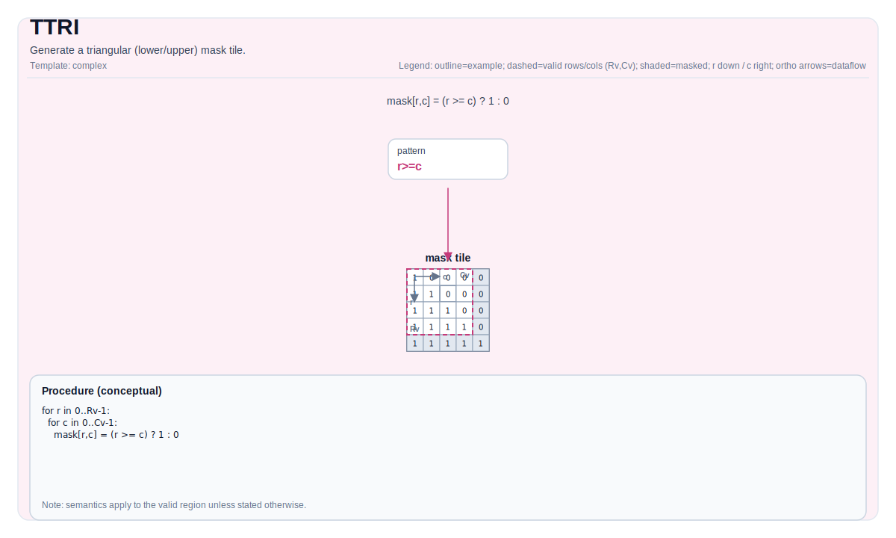

# TTRI

## 指令示意图



## 简介

生成三角（下/上）掩码 Tile。

## 数学语义

设 `R = dst.GetValidRow()`，`C = dst.GetValidCol()`，`d = diagonal`。

下三角（`isUpperOrLower=0`）概念上产生：

$$
\mathrm{dst}_{i,j} = \begin{cases}1 & j \le i + d \\\\ 0 & \text{否则}\end{cases}
$$

上三角（`isUpperOrLower=1`）概念上产生：

$$
\mathrm{dst}_{i,j} = \begin{cases}0 & j < i + d \\\\ 1 & \text{否则}\end{cases}
$$

## 汇编语法

### AS Level 1（SSA）

```text
%dst = pto.ttri %diag : i32 -> !pto.tile<...>
```

### AS Level 2（DPS）

```text
pto.ttri ins(%diag : i32) outs(%dst : !pto.tile_buf<...>)
```

## C++ 内建接口

声明于 `include/pto/common/pto_instr.hpp`：
> 公共包含头为 `<pto/pto-inst.hpp>`，内部声明位于 `pto/common/pto_instr.hpp`。

```cpp
template <typename TileData, int isUpperOrLower, typename... WaitEvents>
PTO_INST RecordEvent TTRI(TileData &dst, int diagonal, WaitEvents &... events);
```

## 约束

- `isUpperOrLower` 必须是 `0`（下三角）或 `1`（上三角）。
- 目标 Tile 在某些目标上必须是行主序（参见 `include/pto/npu/*/TTri.hpp`）。

## 示例

参见 `docs/isa/` 和 `docs/coding/tutorials/` 中的相关示例。

## 汇编示例（ASM）

### 自动模式

```text
# 自动模式：由编译器/运行时负责资源放置与调度。
%dst = pto.ttri %src0, %src1 : (!pto.tile<...>, !pto.tile<...>) -> !pto.tile<...>
```

### 手动模式

```text
# 手动模式：先显式绑定资源，再发射指令。
# pto.tassign %arg0, @tile(0x1000)
%dst = pto.ttri %diag : i32 -> !pto.tile<...>
```

### PTO 汇编形式

```text
%dst = pto.ttri %diag : i32 -> !pto.tile<...>
# AS Level 2 (DPS)
pto.ttri ins(%diag : i32) outs(%dst : !pto.tile_buf<...>)
```
