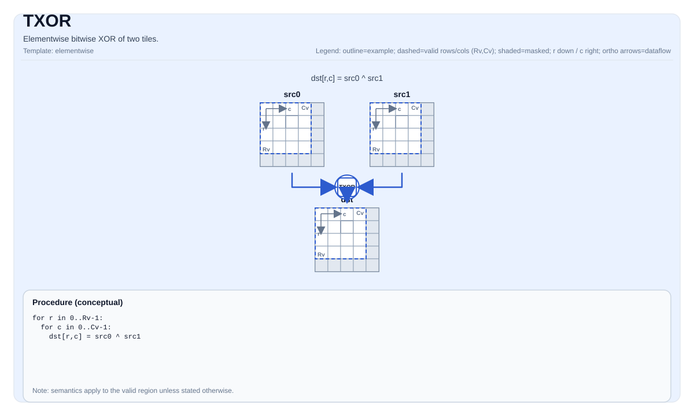

# TXOR

<!-- md-trans-meta sourceCommit=unknown translatedAt=2026-08-26T05:25:06.357Z pushedAt=2026-08-29T09:05:18.475Z -->

## Instruction Diagram



## Introduction

Performs element-wise bitwise XOR on two tiles.

## Mathematical Semantics

For each element `(i, j)` in the valid region:

$$ \mathrm{dst}_{i,j} = \mathrm{src0}_{i,j} \oplus \mathrm{src1}_{i,j} $$

## Assembly Syntax

Synchronous form:

```text
%dst = txor %src0, %src1 : !pto.tile<...>
```

### AS Level 1 (SSA)

```text
%dst = pto.txor %src0, %src1 : (!pto.tile<...>, !pto.tile<...>) -> !pto.tile<...>
```

### AS Level 2 (DPS)

```text
pto.txor ins(%src0, %src1 : !pto.tile_buf<...>, !pto.tile_buf<...>) outs(%dst : !pto.tile_buf<...>)
```

## C++ Built-in APIs

Declared in `include/pto/common/pto_instr.hpp`:
> The public include header is `<pto/pto-inst.hpp>`, and the internal declaration is located in `pto/common/pto_instr.hpp`.

```cpp
template <typename TileDataDst, typename TileDataSrc0, typename TileDataSrc1, typename TileDataTmp,
          typename... WaitEvents>
PTO_INST RecordEvent TXOR(TileDataDst &dst, TileDataSrc0 &src0, TileDataSrc1 &src1, TileDataTmp &tmp, WaitEvents &... events);
```

## Constraints

- The operation iterates over `dst.GetValidRow()`/`dst.GetValidCol()`.
- **Implementation check (Ascend 950PR/Ascend 950DT)**:
    - The element types of `dst`, `src0`, and `src1` must be consistent.
    - The supported element types are `uint8_t`, `int8_t`, `uint16_t`, `int16_t`, `uint32_t`, and `int32_t`.
    - `dst`, `src0`, and `src1` must be row-major.
    - `src0.GetValidRow()/GetValidCol()` and `src1.GetValidRow()/GetValidCol()` must be consistent with `dst`.
- **Implementation check (Atlas A2/A3 training products/Atlas A2/A3 inference products)**:
    - The element types of `dst`, `src0`, `src1`, and `tmp` must be consistent.
    - The supported element types are `uint8_t`, `int8_t`, `uint16_t`, `int16_t`, `uint32_t`, and `int32_t`.
    - `dst`, `src0`, `src1`, and `tmp` must be row-major.
    - The valid shapes of `src0`, `src1`, and `tmp` must be consistent with that of `dst`.
    - In manual mode, the memory regions of `dst`, `src0`, `src1`, and `tmp` must not overlap.

## Temporary Space

### Atlas A2/A3 Training Products/Atlas A2/A3 Inference Products

`tmp` **is used** as intermediate scratch storage. The implementation of Atlas A2/A3 training products/Atlas A2/A3 inference products computes XOR by decomposition: `XOR(a,b) = AND(NOT(AND(a,b)), OR(a,b))`, which requires `tmp` to hold the intermediate result `OR(a,b)`.

- `tmp` must have the same element type as `dst`/`src0`/`src1`.
- `tmp` must be row-major.
- The valid shape of `tmp` must be consistent with `dst` (`tmp.GetValidRow() == dst.GetValidRow()` and `tmp.GetValidCol() == dst.GetValidCol()`).
- In manual mode, the memory region of `tmp` must not overlap with `dst`, `src0`, or `src1`.

### Ascend 950PR/Ascend 950DT

`tmp` is accepted by the API but **not used** by the Ascend 950PR/Ascend 950DT implementation. The Ascend 950PR/Ascend 950DT backend directly uses the `vxor` vector instruction and does not require temporary tile storage. `tmp` is retained in the C++ built-in API signature only for API compatibility with Atlas A2/A3 training products/Atlas A2/A3 inference products.

## Examples

```cpp
#include <pto/pto-inst.hpp>

using namespace pto;

void example() {
  using TileDst = Tile<TileType::Vec, uint32_t, 16, 16>;
  using TileSrc0 = Tile<TileType::Vec, uint32_t, 16, 16>;
  using TileSrc1 = Tile<TileType::Vec, uint32_t, 16, 16>;
  using TileTmp = Tile<TileType::Vec, uint32_t, 16, 16>;
  TileDst dst;
  TileSrc0 src0;
  TileSrc1 src1;
  TileTmp tmp;
  TXOR(dst, src0, src1, tmp);
}
```

## ASM Examples

### Automatic Mode

```text
# Automatic mode: the compiler/runtime is responsible for resource placement and scheduling.
%dst = pto.txor %src0, %src1 : (!pto.tile<...>, !pto.tile<...>) -> !pto.tile<...>
```

### Manual Mode

```text
# Manual mode: explicitly bind resources first, then issue the instruction.
# Optional (when the instruction contains tile operands):
# pto.tassign %arg0, @tile(0x1000)
# pto.tassign %arg1, @tile(0x2000)
%dst = pto.txor %src0, %src1 : (!pto.tile<...>, !pto.tile<...>) -> !pto.tile<...>
```

### PTO Assembly Form

```text
%dst = txor %src0, %src1 : !pto.tile<...>
# AS Level 2 (DPS)
pto.txor ins(%src0, %src1 : !pto.tile_buf<...>, !pto.tile_buf<...>) outs(%dst : !pto.tile_buf<...>)
```
