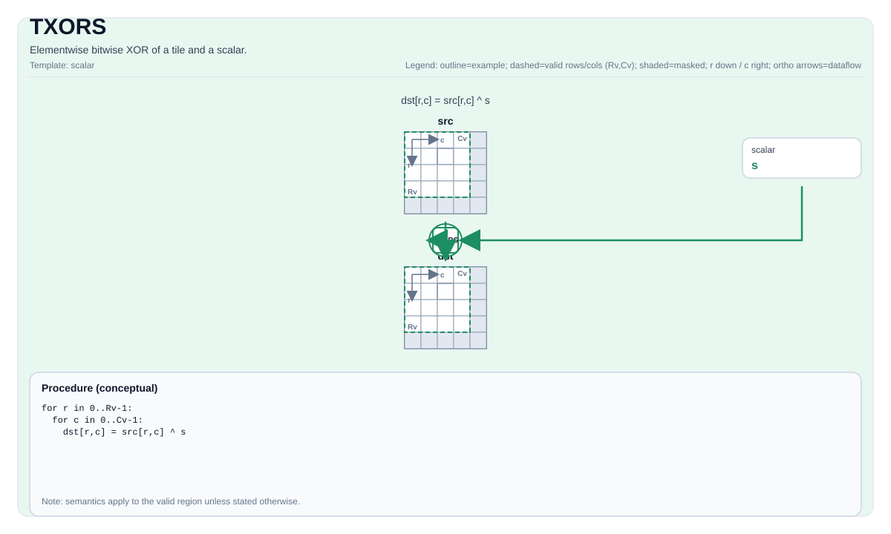

# TXORS

<!-- md-trans-meta sourceCommit=unknown translatedAt=2026-08-26T05:25:09.397Z pushedAt=2026-08-29T09:05:18.475Z -->

## Instruction Diagram



## Introduction

Performs element-wise bitwise XOR between a tile and a scalar.

## Mathematical Semantics

For each element `(i, j)` in the valid region:

$$ \mathrm{dst}_{i,j} = \mathrm{src}_{i,j} \oplus \mathrm{scalar} $$

## Assembly Syntax

Synchronous form:

```text
%dst = txors %src, %scalar : !pto.tile<...>, i32
```

### AS Level 1 (SSA)

```text
%dst = pto.txors %src, %scalar : (!pto.tile<...>, dtype) -> !pto.tile<...>
```

### AS Level 2 (DPS)

```text
pto.txors ins(%src, %scalar : !pto.tile_buf<...>, dtype) outs(%dst : !pto.tile_buf<...>)
```

## C++ Built-in APIs

Declared in `include/pto/common/pto_instr.hpp`:
> The public include header is `<pto/pto-inst.hpp>`, and the internal declaration is located in `pto/common/pto_instr.hpp`.

```cpp
template <typename TileDataDst, typename TileDataSrc, typename TileDataTmp, typename... WaitEvents>
PTO_INST RecordEvent TXORS(TileDataDst &dst, TileDataSrc &src0, typename TileDataSrc::DType scalar, TileDataTmp &tmp, WaitEvents &... events);
```

## Constraints

- **Implementation check (Atlas A2/A3 training products/Atlas A2/A3 inference products)**:
    - The supported element types are `uint8_t`, `int8_t`, `uint16_t`, `int16_t`, `uint32_t`, and `int32_t`.
    - `dst`, `src`, and `tmp` must use the same element type.
    - In manual mode, the memory regions of the source, destination, and temporary storage must not overlap.
- **Implementation check (Ascend 950PR/Ascend 950DT)**:
    - The supported element types are `uint8_t`, `int8_t`, `uint16_t`, `int16_t`, `uint32_t`, and `int32_t`.
    - The element types of `dst` and `src` must be consistent.
    - `src.GetValidRow()/GetValidCol()` must be consistent with `dst`.
- **Valid region**:
    - The operation uses `dst.GetValidRow()`/`dst.GetValidCol()` as the iteration domain.

## Temporary Space

### Atlas A2/A3 Training Products/Atlas A2/A3 Inference Products

`tmp` **is used** as intermediate temporary storage for scalar XOR decomposition. `tmp` must have the same element type and valid shape as `dst`.

### Ascend 950PR/Ascend 950DT

`tmp` is accepted by the API but **not used** by the Ascend 950PR/Ascend 950DT implementation. The Ascend 950PR/Ascend 950DT backend uses the `vxor` vector instruction with a broadcast scalar register and does not require temporary tile storage. `tmp` is retained in the C++ built-in API signature only for API compatibility with Atlas A2/A3 training products/Atlas A2/A3 inference products.

## Examples

```cpp
#include <pto/pto-inst.hpp>

using namespace pto;

void example() {
  using TileDst = Tile<TileType::Vec, uint32_t, 16, 16>;
  using TileSrc = Tile<TileType::Vec, uint32_t, 16, 16>;
  using TileTmp = Tile<TileType::Vec, uint32_t, 16, 16>;
  TileDst dst;
  TileSrc src;
  TileTmp tmp;
  TXORS(dst, src, 0x1u, tmp);
}
```

## ASM Examples

### Automatic Mode

```text
# Automatic mode: the compiler/runtime handles resource placement and scheduling.
%dst = pto.txors %src, %scalar : (!pto.tile<...>, dtype) -> !pto.tile<...>
```

### Manual Mode

```text
# Manual mode: explicitly bind resources first, then issue the instruction.
# Optional (when the instruction contains tile operands):
# pto.tassign %arg0, @tile(0x1000)
# pto.tassign %arg1, @tile(0x2000)
%dst = pto.txors %src, %scalar : (!pto.tile<...>, dtype) -> !pto.tile<...>
```

### PTO Assembly Form

```text
%dst = txors %src, %scalar : !pto.tile<...>, i32
# AS Level 2 (DPS)
pto.txors ins(%src, %scalar : !pto.tile_buf<...>, dtype) outs(%dst : !pto.tile_buf<...>)
```
