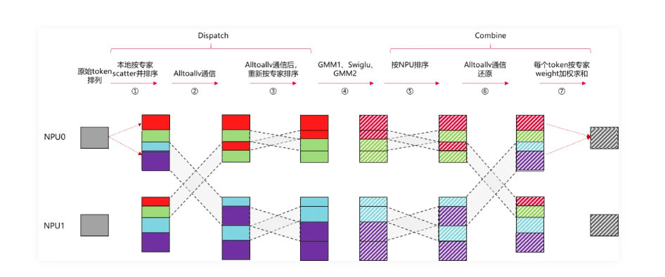
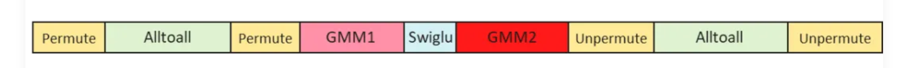
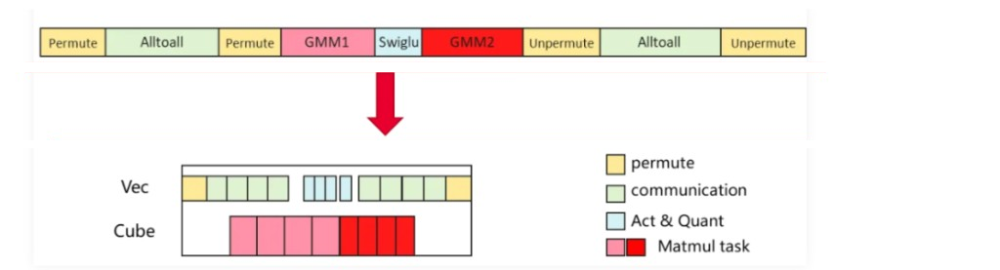
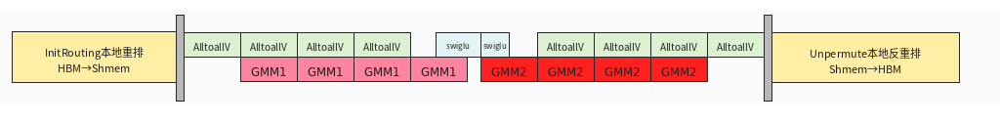
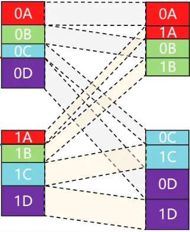
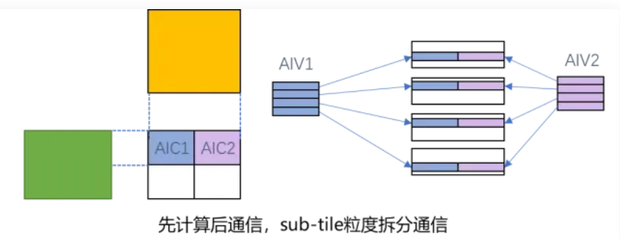
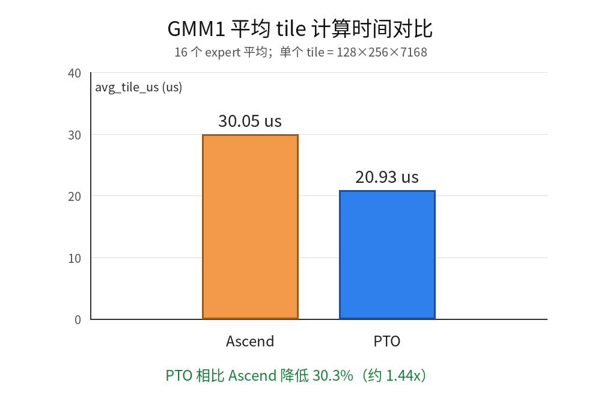
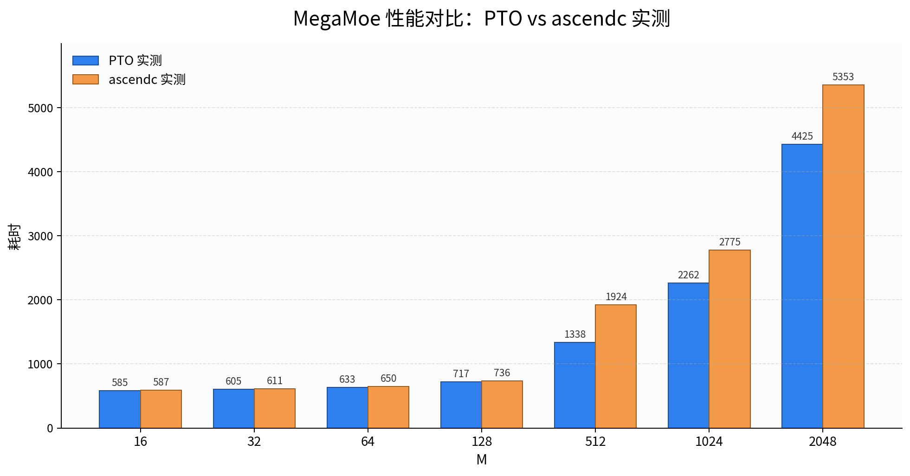

# pto-isa megamo算子

## MOE介绍

### 传统MOE的流程

- ① 本地token permute：源卡内 [token,expert,k] 按expert排序 [expert,token,k]
- ② All2All通信：发送 [expert,token,k] 到目标卡
- ③ 通信后permute： 目标卡将收到的token按照expert再做一次排序 [expert,srcRank,token,k]
- ④ FFN计算：执行GMM1、Swiglu激活函数和GMM2计算。
- ⑤ 计算后unpermute：目标卡将token按照 [srcRank,expert,token,k] 重新排序
- ⑥ AlltoallV还原：将 [expert,token,k] all2allv发回srcRank源卡
- ⑦ 源卡按照topk结果累加，并还原原始token顺序 [token，k]

**实际的效果是串行衔接：**

### Ascend的megamoe的overlap方案

**将通信和计算的粒度拆细,在一个大kernel内实现计算和通信的细粒度的掩盖：**

**实际实现采用expert级的流水overlap：**

- ① 开头：两次permute合并到一起，通过一次轻量的all2all通信对齐内存布局

   

- ② 中间：
  - a.按照expert逐个做AIC和AIV的overlap,第i个专家的GMM可以与第i-1专家的AlltoallV
  - b.swiglu拆成了两段，当GMM1结束的时候，第一段swgilu也已经结束，可以马上开始GMM2
- ③ 结尾: 由于是expert级流水，因此后all2all阶段也省掉了[expert,srcRank,token,k] -> [srcRank,expert,token,k]的重排

**ascendc针对decode 小token量场景也做了针对性的优化：**
  - 前重排阶段，能用UB直接完成的场景，全部放到UB里做
  - combine阶段，采用subtile模式提高多核并发

    

### PTO-ISA 的overlap方案

由于 AscendC MegaMoe 的 overlap 设计思路比较精妙，PTO MegaMoe 主体流程借鉴了其中一些关键算法思路：

- AIC 和 AIV 采用 expert 轮转的方式排布流水；SwiGLU 分为两段，第一段 SwiGLU 尽量压在 GMM2 开始之前完成。
- 前重排阶段使用归并排序，并优先考虑将数据放到 UB 中进行排序；按工作集大小分为 FullLoad、OneCore、MultiCore 三个排序场景，并使用 count-as-flag 机制消除 AlltoAll count 后的全同步。
- Dispatch 阶段根据 UB 192 KiB 的容量，多轮 TLOAD 2 行 token + scale 到 UB 中解包。
- Combine 阶段区分 large 和 small 两种 case；small 场景为了提高 AIV 利用率，采用 subtile 模式进行数据 push。

在其基础上尝试了如下优化。

**有效的优化点：**

- 针对核心的 GMM1 和 GMM2 阶段，采用 PTO tile 编程模式进行优化，使用 swizzle、双缓冲、L1→L0 片上多级复用等手段；实测比 Catlass 快约 40%。
  
- 增加参与 combine 的 AIV 核，在 A3 上有些许效果；但不能增加太多，否则会与 GMM2 的 HBM 访问冲突，影响 GMM2 性能。后续可考虑在 A5 上使用 ubuf→cbuf 能力，降低 HBM 压力。

**无效的优化点：**

- 消减掉 combine→unpermute 的全同步：unpermute 阶段需要 fp32 累加，atomic add 会导致数据要用 fp32 传输，实测性能会下降。
- 修改 SwiGLU 的 overlap 粒度，从 segment 改为 expert overlap：kernel 执行耗时波动会变大，无明显优化。
- 尝试将 dispatch 拉取数据的粒度改为多 AIV 并发拉取 GMM1 的 L1 tile：当前 dispatch 阶段每个 rank 每次拉取的 size 并不大，每个 rank 分 128 行已经相当于是 tile 粒度，约 1 MiB；改成多 AIV 拉取对首 expert 的 GMM1 运算无明显提升。
- 将 combine 阶段的 TSTORE 改为 TPUT / TPUT_ASYNC 批量打包：受限于 HBM 带宽，会与 GMM2 竞争，性能下降。

**PTO-ISA 实测效果对比：**

整体来看，PTO megamoe 在小 M 场景下与 ascendc 实测基本持平；随着 M 增大，PTO 的 GMM 和通信计算 overlap 优势逐步体现，在 M=512 及以上 case 中整体领先更明显，可以有20%的提升。

### PTO megamoe 2048 case overlap实况：

- 通信受限于计算的效率，overlap无法再进一步的提升，仅在dispatch->gmm1之间有几十us的计算空闲
- aic是满载运行，aiv在dispatch和combine阶段受限于HBM带宽，也没有用满
- 可以考虑后续在a5上，通过ubuff->cbuff直通，降低aic/aiv对HBM带宽的争用，提高aic/aiv各自的效率

