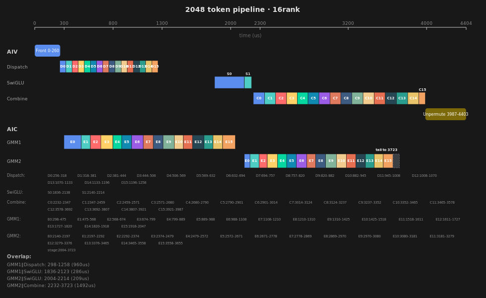
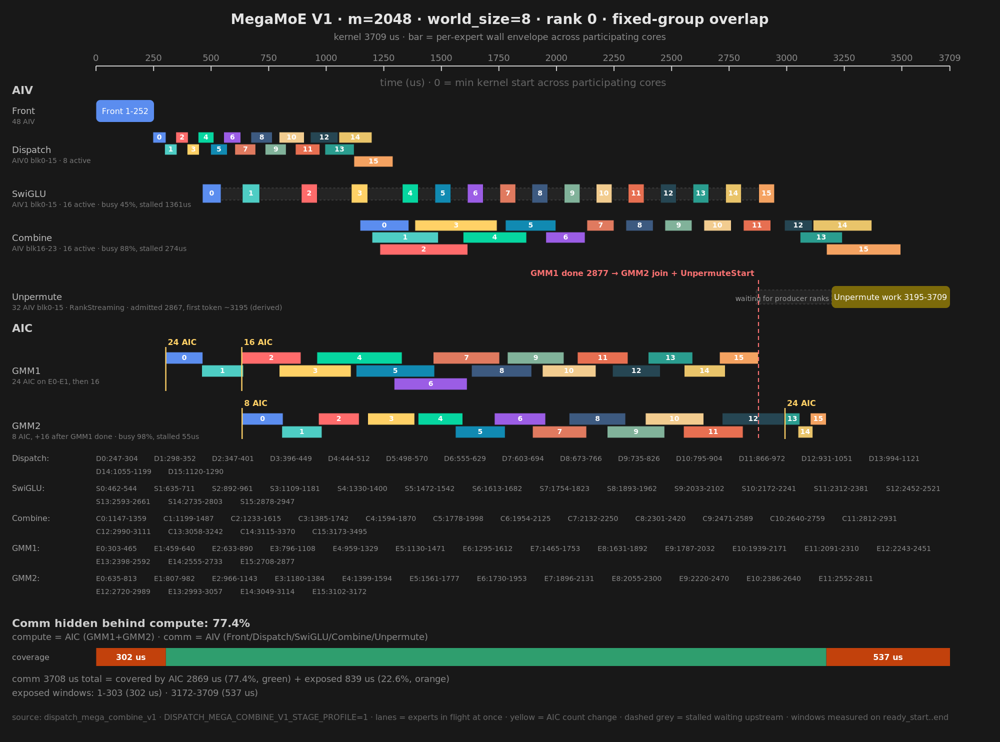

# PTO MegaMOE 优化方案V1

<style>
.pto-api { color: #ff6a00; }
h2, h3 {
  color: #8B0000;
  font-weight: bold;
}
</style>

## 基线版本的 overlap 状况 --即overview.md中的版本



## 优化版本的 overlap 方式


### 优化原则

对 AIC 和 AIV 进行分组动态调度，关键原则如下：
1. **overlap主序变化：** 从阶段主序的expert间overlap粒度，改为Expert主序的阶段间overlap
2. **优先打满 AIC：** GMM2 尚无输入时，把全部 24 个 AIC 都投入 GMM1；GMM1 结束后，立即将释放出来的 AIC 转入 GMM2 的尾部计算。
3. **降低 AIV 对 AIC 的资源抢占：** 同一个 AI Core 内的 AIC 与 AIV 共用 MTE 和 HBM 带宽，GMM1/GMM2 计算期间应尽量避开大数据量的 AIV 搬运。
4. **Unpermute 分阶段启动：** 不再整体等待所有 rank 的 Combine 结束。前 32 个 AIV 先处理已就绪的数据，Combine 完成后再加入 16 个 AIV，由全部 48 个 AIV 处理剩余数据。

### AIC/AIV 分组

一张卡有 24 个 AIC 和 48 个 AIV，按物理 AI Core 划分为固定分组：

| 阶段 | 单元 | 物理核 | 分组大小 |
| --- | --- | --- | ---: |
| GMM1 | AIC | 0..15 | 16 |
| GMM2 | AIC | 16..23 | 8 |
| Dispatch | AIV0 | 0..15 | 16 |
| SwiGLU | AIV1 | 0..15 | 16 |
| Combine | AIV0 | 16..23 | 8 |
| Unpermute | AIV0 + AIV1 | 0..23 | 48 |

Unpermute 不单独占核。物理核 0..15 上的 32 个 AIV 完成本职阶段后先转入，物理核 16..23 上的 16 个 AIV 在 Combine 完成后加入。

**AIC 动态调度**

1. 按计算量分两组：物理核 0..15 的 16 个 AIC 负责 GMM1，物理核 16..23 的 8 个 AIC 负责 GMM2。
2. GMM1 的前 `fullAicGmm1ExpertCount`（=2）个 expert 由全部 24 个 AIC 参与，从第 3 个 expert 起仅由 GMM1 组的 16 个 AIC 继续处理。
3. GMM2 按 `(EP, M)` 配置检查起点：EP8 的 M=16 从 expert 12 起检查，其他目标 M 从 expert 13 起检查；EP16 从 expert 11 起检查。确认 GMM1 结束后，GMM1 组的 16 个 AIC 并入 GMM2，余下 expert 由全部 24 个 AIC 共同完成。合组时刻取决于 GMM1 的结束时间，并非固定的最后若干个 expert。

**AIV 动态调度**

1. 按阶段分三组：物理核 0..15 的 AIV0 负责 Dispatch，同批核的 AIV1 负责 SwiGLU，物理核 16..23 的 AIV0 负责 Combine，共 8 个 AIV。Unpermute 最终复用全部 48 个 AIV。
2. SwiGLU 计算量小。当前 AIV 与 AIC 的分组分工主要用于减少 AIV 对 AIC 的资源争用，同时提高计算与通信的 overlap 程度。
3. Unpermute 分两阶段执行：当各 source rank 的 Combine 达到第一阶段所需的 expert 进度后，物理核 0..15 上的 32 个 AIV 先处理已就绪部分；本卡 Combine 完成后，物理核 16..23 上的 16 个 AIV 加入，由全部 48 个 AIV 处理剩余部分。
4. Combine 的数据量约为 Dispatch 的 2 倍，需要延后其启动时机，避免与 Dispatch 抢占同一段带宽。启动点由 `combineStartAfterGmm2Expert` 控制，随 shape 变化：M=16 与 M=128 为 3，M=1024/2048 为 2，M=32/64/512 为 0（不等待）。

### Expert 流水

```text
Dispatch(e) -> GMM1(e) -> SwiGLU(e) -> GMM2(e) -> Combine(e)
                                                        |
                                                        +-> source-rank Unpermute
```

各阶段独立顺序处理 expert，通过 expert-ready 信号衔接；不同阶段不要求保持固定的 expert 间距。

为减少 AIV 搬运对 AIC 计算的影响，Combine 不一定从 GMM2 expert 0 完成后立即启动。它先等待
`combineStartAfterGmm2Expert` 指定的 GMM2 expert ready，再从 Combine expert 0 开始追赶流水。

### 关键 tiling 参数
kCanonicalShapeTilingConfigs
以下配置对应 `K=7168、N=4096、topK=8、expertPerRank=16、worldSize=8`。表中的 expert ID 从 0 开始：

| M | GMM1 全 AIC expert 数 | SwiGLU AIV 数 | GMM2 扩组最早检查 expert | Combine 启动前等待的 GMM2 expert |
|---:|---:|---:|---:|---:|
| 16 | 2 | 8 | 12 | 3 |
| 32/64/512 | 2 | 16 | 13 | 0 |
| 128 | 2 | 16 | 13 | 3 |
| 1024/2048 | 2 | 16 | 13 | 2 |

字段对应关系：

- `fullAicGmm1ExpertCount`：GMM1 开头使用全部 24 个 AIC 的 expert 数。
- `swigluActiveGroupSize`：实际参与 SwiGLU 的 AIV 数。
- `gmm2JoinCheckStartExpert`：由 `(EP, M)` 配置 GMM2 最早从哪个 expert 开始检查 GMM1 是否结束；成功扩组后，后续 expert 不再重复决策。
- `combineStartAfterGmm2Expert`：Combine 启动前等待的 GMM2 expert ID。例如值为 2 时，先等 GMM2 expert 2 ready，再从 Combine expert 0 开始处理。
- `unpermutePhase1ReadyExpertCount`：Unpermute 第一阶段启动所需的各 source rank 最小 expert 进度。第一阶段使用 32 个 AIV，第二阶段扩展为全部 48 个 AIV。

### 阶段同步

固定分组后的阶段间同步主要采用单向软件通知模型：

```text
Producer group（producerCount=N）
  core 0   core 1   ...   core N-1
     \        |              /
      \-- 每个 core scalar 写 arrival[producerId] = epoch --/
                    |
                    v
       组内 coordinator：MTE 批量读 N 个计数并取共同进度
                    |
                    v
       coordinator：MTE 批量发布 ready[consumerId] = epoch，共 M 个
                    |
        +-----------+-----------+
        v           v           v
Consumer 0     Consumer 1 ... Consumer M-1
        各自等待自己的 ready 后开始处理
```

`producerCount` 和 `consumerCount` 由当前 expert 的 tiling/角色状态决定；同步区按最大组大小预留，
每次只读取有效的 producer 前缀、发布有效的 consumer 前缀，因此支持分组扩缩容。例如 GMM1 为 `24→16`，
GMM2 尾部可由 `8→24`。

扩缩组只在 expert 边界发生，producer 和 consumer 使用同一个切换条件：

```text
GMM1 缩组
  expert 0..1 : logical core 0..23 工作
  expert 2..  : logical core 0..15 工作，16..23 退出 GMM1

GMM2 扩组（J 为统一决定的 join expert）
  expert < J  : 原 GMM2 组写 arrival[16..23]，producerCount=8
  expert >= J : 加入组写 arrival[0..15]，原组仍写 arrival[16..23]，producerCount=24
```

组内 `epoch` 是单次 kernel launch 内按 expert 单调推进的进度值，不是一次性的布尔 flag；每次 launch
开始时会重置组内同步区。coordinator 读到的共同进度若已超过目标 expert，一次检查即可覆盖此前连续
完成的多个 expert，consumer 后续检查直接命中，不需要重新等待。跨 launch 的通知使用独立的
DataReady epoch 区分轮次，避免复用 HCCL window 时命中上一轮的状态。

跨 rank 时采用同样的单向通知思想：producer 写完数据后发布 DataReady，consumer 只等待自己需要的数据，
不做全 rank barrier。


### 与基线性能对比

#### A3 EP8 对比

| M    |  基线 avg (us) | 优化版本 avg (us) | 优化版本 - 基线 (us) | 优化版本 加速率 |
| ---- | ----------- | ----------- | ------------ | ------ |
| 16   | 584.09      | 573.08      | -11.01       | +1.88%  |
| 32   | 601.39      | 588.30      | -13.09       | +2.18%  |
| 64   | 634.77      | 627.77      | -7.00        | +1.10%  |
| 128  | 695.31      | 696.04      | +0.73        | -0.10% |
| 512  | 1394.90     | 1234.03     | -160.87      | +11.53% |
| 1024 | 2251.61     | 2016.18     | -235.43      | +10.46% |
| 2048 | 4285.13     | 3756.88     | -528.25      | +12.33% |

A3 EP8 的小case略有优化，大case有10%~12%的可观优化


#### A3 EP16 对比
| M    | 基线 avg (us) | 优化版本 avg (us) | 优化版本 - 基线 (us) | 优化版本 加速率 |
| ---- | ------------- | ----------------- | -------------------- | --------------- |
| 16   | 584.52        | 579.02            | -5.50                | 0.94%           |
| 32   | 605.18        | 600.38            | -4.80                | 0.79%           |
| 64   | 633.47        | 636.46            | +2.99                | -0.47%          |
| 128  | 717.26        | 707.30            | -9.96                | 1.39%           |
| 512  | 1337.57       | 1190.04           | -147.53              | 11.03%          |
| 1024 | 2261.64       | 1964.26           | -297.38              | 13.15%          |
| 2048 | 4380.82       | 3714.16           | -666.66              | 15.22%          |

A3 EP16 的小case略有优势， 大case有11%~15%的可观优化
